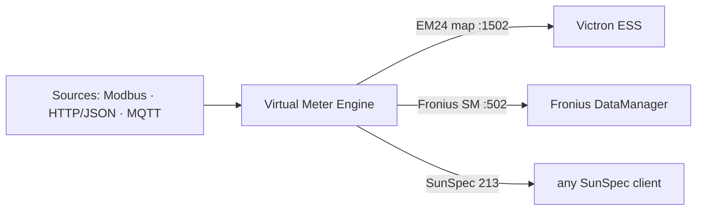

# Multi-Bus Gateway

> **Ancestry.** Multi-Bus Gateway 3.0.0 is the direct successor of the
> *Janitza UMG 512 Modbus/MQTT monitor* project — the same field-tested
> engine, generalized into a protocol gateway: multiple southbound sources
> (Modbus TCP/RTU, HTTP/JSON, MQTT), device-template catalog, composite
> virtual meters with an in-band quality convention, and an operator UI
> with commissioning diagnostics. The Janitza UMG 512-PRO remains a
> first-class supported device (bundled template + verified register map).

[🇷🇴 Română](README.md) | 🇬🇧 **English**

[](https://github.com/sm26449/multi-bus-gateway/releases)
[](https://github.com/sm26449/multi-bus-gateway/pkgs/container/multi-bus-gateway)


[](LICENSE)

> **A software-defined protocol gateway — acquire, verify, monitor and
> route field data. Retrofit, don't replace.**

It reads existing meters and sensors — over **Modbus TCP**, **Modbus RTU**,
**HTTP/JSON** (Solar API, Shelly, Tasmota…) or **MQTT** — and routes the
data to **MQTT, InfluxDB/Grafana, Home Assistant, REST and JSON feeds**.
And, uniquely, it re-serves the physical sources as **virtual Modbus
meters** (Carlo Gavazzi EM24, Fronius Smart Meter, SunSpec), so Victron,
Fronius and any PLC/SCADA each see the meter they expect. Everything runs
in one container, on hardware you own.

- 🔌 **Retrofit instead of replacement** — digitize installed equipment;
  **zero new hardware**.
- 🧩 **Multi-source, multi-sink** — each device with its own routing (MQTT
  topic prefix, InfluxDB bucket, opt-in outputs), independent pipelines.
- 🪞 **One meter, many consumers** — emulated virtual meters with explicit
  staleness policies and an in-band quality block.
- 🛠️ **Operator-grade UI** — discovery wizard, frame-level diagnostics,
  config snapshots with rollback, roles and an audit trail.
- 📟 **Device Builder (remote ESP32 nodes)** — generate, compile and flash
  ESPHome firmware for far-away RS485 readers straight from the UI (builds
  on your own ESPHome container, browser USB flashing, OTA, automatic
  adoption as an MQTT device — zero double configuration).
- ⚡ **PQ event recorder (Janitza)** — permanently archives the meter's
  on-device power-quality event ring (dips/outages/RVC + RMS waveforms),
  with a dedicated tab, alerts and a queryable history —
  [manual §11c](docs/MANUAL.md#11c-power-quality--the-pq-event-recorder-janitza).

> **Deliberate scope:** it is a **protocol gateway**, not an
> energy/reporting application — cost, tariffs, billing and analytics stay
> downstream.

📖 **[User Manual](docs/MANUAL.md)** ·
🏗️ **[Architecture (diagrams)](docs/architecture.md)** ·
🔌 **[API Reference](docs/API.md)** ·
📡 **[Virtual meter spec](docs/virtual-meter-spec.md)** ·
🗂️ **[Device catalog](docs/device-catalog.md)** ·
🖼️ **[Visual UI guide](docs/GHID-UI.md)** (RO notes) ·
🛡️ **[Reliability & fail-safety](docs/reliability.md)** ·
⚙️ **[Config reference](docs/config-reference.md)** ·
⬆️ **[Upgrade guide](docs/upgrade-guide.md)** ·
📥 **[YAML import](docs/yaml-import.md)** ·
🚀 **[Install](docs/install.md)** ·
🔧 **[Operations (upgrade, backup, uninstall)](docs/operations.md)** ·
🩺 **[Troubleshooting](docs/troubleshooting.md)** ·
📨 **[MQTT contract](docs/mqtt-contract.md)** ·
🗄️ **[InfluxDB schema](docs/influxdb-schema.md)** ·
🔒 **[Security hardening](docs/security-hardening.md)** ·
🏷️ **[Releasing](docs/releasing.md)**

## Why software, not a box?

A dedicated Modbus-to-MQTT appliance is one option. This is the other: the
same job in software you own and can extend — on hardware you already have,
or on a ~€50 Raspberry Pi with a USB/HAT RS-485 adapter, DIN-rail-mountable
all the same. No vendor lock-in, no per-box cost.

- ⚡ **Configurable sub-second polling** — tunable per poll-group with no
  fixed floor (we run 250 ms on the realtime group); fixed-function
  gateways typically stop at ~5 s.
- ♾️ **No device / value caps** — bounded only by your host.
- 🪞 **Virtual meters** — a read-only gateway can't re-serve data as
  emulated devices; this one can.
- 🔓 **Open source, commodity hardware** — inspect it, fork it, add a
  protocol.
- 🍓 **Frugal, measured on constrained hardware** — ~90 MB RAM and a few
  percent CPU on a typical install, no leaks. An **RPi 3 comfortably runs
  ~4–5 devices + ~3 virtual meters** (realtime ≥ 1 s), a Pi 4/5 far more.
  Full capacity envelope + recommended profile: [MANUAL §18b](docs/MANUAL.md#18b-running-on-constrained-hardware-raspberry-pi).

## Features

**Southbound (acquisition)**
- **Modbus TCP** and **Modbus RTU master** (RS-485 serial), with batched
  reads, retries and an error taxonomy
  (`timeout` / `exception_N` / `connection`).
- **HTTP/JSON** — any JSON endpoint, per-register `json_path`, SSRF-guarded
  (private LAN only by default).
- **MQTT-in** — subscribe to a broker; value from the JSON payload
  (`json_path`) or the bare payload; per-register topics with `+`/`#`
  wildcards.
- **Device templates** — the register map as a portable JSON file; 11
  bundled, field-tested maps with documented provenance
  ([catalog](docs/device-catalog.md)): Janitza UMG 512-PRO (4,126
  registers), ABB B21/B23, Carlo Gavazzi EM24, Eastron SDM120/SDM630,
  Schneider iEM3000, Fronius Smart Meter 65A-3 + 3 MQTT maps (Zigbee2MQTT,
  Theengs BLE, generic JSON).
  In-UI editor + upload + export + **CSV/YAML import**
  ([CSV](docs/csv-import.md), [YAML](docs/yaml-import.md)). Per-register
  status decode (`enum`/`bits` → text, e.g. the EM24/Fronius identity
  codes), `nan` sentinels, a symmetric **monotonic** counter filter and
  `offset` — identical on every transport.
- **Canonical field naming** — uniform register names across every device
  (`voltage_l1_n` everywhere), so MQTT topics and InfluxDB fields are
  predictable — and **the unit is part of the contract** (energy = the Wh
  family; the editor flags a mismatched unit amber, the save warns).
  One-click **Auto-canonicalize** infers names for a cryptic imported map,
  conservatively ([dictionary](docs/canonical-fields.md)).
- **Discovery wizard** — CIDR scan on the Modbus port, unit-ID sweep (TCP
  and RTU), **SunSpec model walk**, MQTT topic browse with payload previews,
  Fronius Solar API discover, **ESPHome node scan** (native API 6053, works
  from Docker without mDNS); "Use" prefills the wizard.
- **Restore a deleted device** — deleting keeps the full definition; a
  "Deleted devices" card offers one-click restore (connection + template +
  registers) or permanent "forget".

**Measurements**
- Per-device selected registers, **poll groups**
  (realtime/normal/slow, 0.05 s–24 h intervals, hot-reload).
- **Calculated registers** — a safe expression engine (whitelisted AST)
  with `prev()` and `dt` for rates (`(E - prev(E)) / dt * 3600`),
  cross-device references, live preview, reusable presets; they flow to
  every output.
- Per-register **thresholds** (warning/danger color coding) on the
  dashboard.

**Northbound sinks — all opt-in, per device**
- **MQTT** — `changed`/`all` modes, retain/QoS, TLS/mTLS, Last-Will +
  per-device retained availability, optional heartbeat,
  **Home Assistant autodiscovery** (separate HA device per source, stable
  `mbg_dev_*` unique ids, a connectivity sensor, and writable registers
  become **`number`/`select` entities** with template-declared bounds).
- **InfluxDB** — per-device bucket (auto-created), timestamps = read time,
  **disk-persisted store-and-forward buffer** (no data loss across
  outages; idempotent replay with original timestamps).
- **REST push** — periodic JSON telemetry POST to a URL/webhook,
  `native`/`flat` formats, masked auth headers, redirects refused.
- **HTTP/JSON output** — live values as a read-only feed at
  `GET /api/meters/<id>` (Solar-API style).

**Virtual meters**
- Emulations: **Carlo Gavazzi EM24** (Victron), **Fronius Smart Meter TS**,
  **SunSpec 213** — plus any user YAML template.
- **Multi-source composites**: rows from several devices
  (`device.register`), sums, constants; per-row freshness bounds.
- **Staleness policies** (`legacy`/`fail`/`sentinel`/`hold`) — absence is
  never served as 0/false; sums take their worst member's quality.
- **In-band quality block at 61440** (convention v1) — data quality on the
  same Modbus connection ([spec](docs/virtual-meter-spec.md)).
- Full observability: last-1024 query log, stats, address-range decode, a
  freshness watchdog (stale source → the server goes silent so the
  consumer's fail-safe engages).

**Device Builder — remote ESP32/ESP8266 nodes (ESPHome)**
- **Generate firmware from a template** — pick a Modbus template + registers
  and get complete YAML for a node that reads the meter over RS485 and
  publishes MQTT back to the gateway; build/OTA on your own ESPHome container
  (bundled in compose, zero-config).
- **One-click Adopt** — also creates the paired mqtt-in device with
  byte-identical topics — data flows with no double configuration.
- **Browser USB flashing** (vendored esp-web-tools, no cloud) + Improv Wi-Fi;
  **mDNS import**; reusable hardware profiles; **Update all** (bulk rebuild +
  OTA) — all through one interface and audit trail.

**Diagnostics (commissioning)**
- Frame-level **bus monitor** — TX/RX hex, decode, latency, **each retry as
  its own entry**; RAM-only ring, disabled by default.
- **Register probe** — data type × word order matrix
  (ABCD/CDAB/BADC/DCBA), hex + ASCII: the endianness workbench.
- **Payload sample** for the `json_path` picker; **SunSpec scan**.

**Config safety**
- **Automatic snapshots** on every config change (50 kept) + manual ones,
  **semantic diff** between snapshots, reversible **rollback**, and a
  **last-known-good boot seatbelt** (a broken config.yaml is restored
  automatically at boot).
- **Backup export/import ZIP** — secrets stripped by default (incl. the
  ESPHome password and webhook tokens); includes per-device registers,
  templates, virtual meters, hardware profiles and calculated presets;
  passkeys only in a secret-bearing backup. Identity files (`passkeys.json`,
  `audit.jsonl`) are created `0600`. Import merges
  import (secrets survive the round-trip).

**Security (all opt-in; trusted-LAN by default)**
- **Login** with sessions + per-IP lockout; **admin / operator / viewer
  roles** (operator = live actions, no configuration changes).
- **Passkeys (WebAuthn)** — require a secure context (localhost or a
  hostname over HTTPS).
- **Audit trail** (rotated JSONL; logins, writes, exports; redacted
  payloads), **API key** (`X-API-Key`), **IP allowlist**,
  `ui.trusted_proxies` for reverse proxies (Traefik), built-in HTTPS,
  **canonical-address redirect** (`ui.canonical_url`, `?local` escape hatch).
- **Gated Modbus writes** — off by default; template allowlist with
  `write_min`/`write_max`, **crash-safe dead-man leases** (auto-revert to
  `write_safe`), the primary device always read-only.

**Observability & UX**
- **Prometheus `/metrics`** (device/sink/vmeter series), a **Status** page
  with the error taxonomy, a **persisted event log**, and a
  container-probe-correct `/health`.
- **Infrastructure alerts** over MQTT + webhook
  ([guide](docs/alerts-webhooks.md)).
- **EN+RO i18n** (languages are `ui/languages/*.json` files — no rebuild),
  configurable **timezone** for monthly reports, real-time WebSocket,
  hot-reload nearly everywhere.

## 🔌 Virtual meters

One meter at the grid connection point measures everything. But Victron
wants a *Carlo Gavazzi EM24*, Fronius wants a *Fronius Smart Meter*,
another system wants SunSpec. Instead of buying three meters, you **define
them as templates** and serve them all from the sources you already have —
each an isolated Modbus-TCP server fed from live values.



**Two modes:** ① run *parallel* to the real meter to validate risk-free,
then ② *consolidate* — the virtual meter replaces the physical one. With
full query-log observability the whole way — the very tool we used to
reverse-engineer the Fronius Smart Meter protocol.

### Composite meters (multi-source aggregator)

A virtual meter can gather registers from **several sources at once** — a
Modbus meter + an HTTP inverter + MQTT sensors — into one Modbus TCP map
and one JSON feed (`/api/virtual-meters/<id>/values`): a PLC/SCADA reads
everything in a single poll.

**The staleness convention** (absence is NEVER served as 0/false — a frozen
value can mislead a control loop):

| Policy (`on_stale`) | Stale/missing register | Use for |
|---|---|---|
| `legacy` (default) | classic single-source behavior: one instance-level watchdog | existing meters — untouched |
| `fail` | any read touching it → **Modbus exception**; spanning blocks refused (no partial truth) | control consumers (Victron, PLC) |
| `sentinel` | **SunSpec N/A**: float→NaN, int16→0x8000, uint16→0xFFFF… | sentinel-aware consumers |
| `hold` | last value up to `max_hold_s`, then like `fail` | tolerant displays |

Sums take the quality of their **worst** member — never partial totals.
Optionally, the **in-band quality block at 61440** puts the data quality on
the Modbus connection itself ([spec](docs/virtual-meter-spec.md)).


## Quick start

```bash
git clone https://github.com/sm26449/multi-bus-gateway.git
cd multi-bus-gateway
cp .env.example .env          # recommended — change the change-me passwords
docker compose up -d          # the COMPLETE stack: gateway + MQTT (mosquitto)
                              # + MQTT Explorer + InfluxDB + Grafana + ESPHome
# Admin password generated on first boot (printed once):
docker compose logs multi-bus-gateway | grep -A3 'FIRST RUN'
# UI: http://localhost:8080 · MQTT Explorer: :4000 · Grafana: :3000
```

Nothing external to install: the broker ships in the stack and the gateway
publishes to it from the first boot (default host `mosquitto`), the
Explorer shows the topics flowing, and InfluxDB self-configures on first
boot. Want minimal? `docker compose up -d multi-bus-gateway mosquitto`.
Your own broker/Influx? Repoint the gateway from the UI whenever you like —
the bundled ones are ordinary containers.

Already running a stack on the shared network (existing broker + Influx)?
Use the overlay and start only the gateway — it joins the existing network
(default `pv-stack-network`, overridable via `PV_STACK_NETWORK`):

```bash
docker compose -f docker-compose.yml -f docker-compose.external-network.yml \
  up -d multi-bus-gateway
```

### Prebuilt image (no local build)

A multi-arch image (amd64 + arm64, Raspberry Pi included) is published to
the GitHub Container Registry on every release:

```bash
docker run -d --name multi-bus-gateway --restart unless-stopped \
  -p 8080:8080 -p 1502-1512:1502-1512 -p 502:502 \
  --sysctl net.ipv4.ip_unprivileged_port_start=0 \
  --env-file .env -v "$PWD/config:/app/config" \
  ghcr.io/sm26449/multi-bus-gateway:latest
```

> **Note:** `docker run` starts ONLY the gateway — no bundled MQTT broker,
> so point `MQTT_BROKER` at an existing one (or use compose, which brings
> the whole stack).

With compose the same image is the default: `docker-compose.yml` names
`ghcr.io/sm26449/multi-bus-gateway:${MBG_VERSION:-latest}`, so

```bash
MBG_VERSION=3.79.0 docker compose pull && docker compose up -d
```

runs a release without building anything (`docker compose build` still
builds from source when you want to). The RTU serial bridge is published the
same way as `ghcr.io/sm26449/multi-bus-gateway-serial-bridge`. Upgrades and
rollbacks by tag: [docs/upgrade-guide.md](docs/upgrade-guide.md); how a
release is cut: [docs/releasing.md](docs/releasing.md).

> **Ports:** `8080` = Web UI · `1502-1512` = virtual meters (grow via
> `VMETER_PORT_START/END`) · `502` = the standard Modbus port some
> consumers poll (drop it if it's taken on the host; it is a privileged
> port and the app runs non-root since 3.24.1, hence the
> `net.ipv4.ip_unprivileged_port_start=0` sysctl above — drop them together). For RTU start the bundled
> serial bridge — `docker compose --profile rtu-bridge up -d` (recommended) —
> or pass the adapter into the container (`devices:` in compose). Full guide:
> [docs/MANUAL.md](docs/MANUAL.md).

### InfluxDB and Grafana

They are **part of the default stack** — nothing to start separately. On
first boot InfluxDB self-configures (org/bucket `multibus`; change the
password/token in `.env`), then enable the sink in the UI (Config →
InfluxDB) and paste the token. Grafana: `http://localhost:3000`. Don't
want them? `docker compose up -d multi-bus-gateway mosquitto` starts just
the core.

## Configuration

> **You can configure everything from the UI.** Device connections, MQTT
> and InfluxDB are editable live — saved to `config/config.yaml` (a mounted
> volume) and applied **without a restart**. The `.env` variables are
> **optional**: use them to pre-seed a fresh deploy or to pin values in an
> immutable setup. A setting provided via env takes precedence and shows as
> **locked** in the UI. Note: `docker-compose.yml` ships with the
> Modbus/MQTT/InfluxDB `environment:` pass-through lines **commented out** —
> uncomment the ones you want, or a `.env` value never reaches the container
> (with plain `docker run`, `--env-file .env` passes everything directly).

The `.env` essentials (full list in the
[manual](docs/MANUAL.md#3-first-configuration)):

```bash
MODBUS_HOST=192.168.1.100     # the primary device
MQTT_BROKER=mosquitto
INFLUXDB_ENABLED=false
UI_PORT=8080
API_KEY=                      # optional: require X-API-Key on mutations
```

Files under `config/` (the volume): `config.yaml` (globals + devices),
`selected_registers.json` + `devices/<id>/selected_registers.json`
(register selections), `templates/` (vmeter templates),
`virtual_meters.yaml` (instances), `snapshots/` (automatic snapshots),
`audit.jsonl`, `events.jsonl`, `passkeys.json`.

## Web UI

Four main areas — **Dashboard** (global), **Devices** (per-device
workspace: Overview / Edit / Registers / Calculated / Outputs / Monitor /
History / Energy), **Virtual Meters**, **Diagnostics**, **Status** and
**Config**. Everything specific to one device lives in its workspace, not
in a global menu. Full tab-by-tab tour:
[manual §4](docs/MANUAL.md#4-the-web-ui-tab-by-tab).

## API

140+ REST endpoints + WebSocket, grouped by domain (devices, registers,
virtual meters, diagnostics, config, snapshots, audit, metrics), each with
its minimum required role — the full reference, hand-maintained and
checked against the routes in the code:
**[docs/API.md](docs/API.md)**.

```bash
curl -s http://localhost:8080/api/status | jq .devices
curl -s http://localhost:8080/metrics | grep gateway_device_up
```

## Security

By default the appliance targets a **trusted LAN** — everything is open
locally and every defense layer is opt-in:

> **🔐 First boot generates a login.** A fresh install (no `config.yaml`)
> starts with authentication **enabled**: an admin password is generated,
> stored hashed, and printed **once** to the log —
> `docker compose logs multi-bus-gateway | grep -A3 'FIRST RUN'`. Change it
> after the first login (Settings → Security). On bare metal the UI binds to
> `127.0.0.1` by default; the container image explicitly sets
> `UI_HOST=0.0.0.0` (exposure is governed by the compose port mapping).
> Anyone who can reach the port can also reach the Modbus writes and the
> virtual-meter servers — treat access accordingly.

- **Login + roles** (admin/operator/viewer), per-IP lockout, **WebAuthn
  passkeys**, HttpOnly sessions (7-day sliding).
- **API key** (`API_KEY` → `X-API-Key` on mutations), **IP allowlist**,
  built-in **HTTPS** or a reverse proxy with `ui.trusted_proxies`
  (Traefik), **canonical address** (`ui.canonical_url`) with a `?local`
  escape hatch.
- **Modbus writes** off by default and, even when enabled, only on
  registers declared writable in the template, with bounds and dead-man
  leases; an **audit trail** for everything.
- SSRF guards on server-side fetches, refused redirects, origin-based CSRF
  checks, secrets redacted from logs and backups.

Details and concrete steps: [manual §16](docs/MANUAL.md#16-security).

## Project structure

```
multi-bus-gateway/
├── config/                    # Config volume (examples included)
├── docs/                      # Manual EN/RO, architecture, API, specs
├── multibus/                  # The Python package (gateway engine)
│   ├── api.py                 # REST API + WebSocket (FastAPI)
│   ├── routes/                # Domain route modules
│   ├── modbus_client.py       # Modbus TCP/RTU driver
│   ├── http_client.py         # HTTP/JSON driver
│   ├── mqtt_input.py          # MQTT-in driver
│   ├── mqtt_publisher.py      # MQTT sink + HA discovery
│   ├── influxdb_publisher.py  # InfluxDB sink + buffer
│   ├── rest_push.py           # REST push sink
│   ├── virtual_meter*.py      # Virtual meter engine
│   ├── calc_engine.py         # Calculated registers
│   ├── device_templates/      # Bundled register maps
│   ├── snapshots.py           # Snapshots + LKG seatbelt
│   ├── auth.py / passkeys.py  # Login, roles, WebAuthn
│   ├── audit.py / event_log.py
│   └── bus_trace.py / discovery.py / alerts.py …
├── ui/                        # Vanilla-JS SPA (i18n in ui/languages/)
├── tests/                     # Test suite (pytest)
├── main.py                    # Entry point
├── Dockerfile / docker-compose.yml (+ docker-compose.external-network.yml — shared-network overlay)
├── mosquitto/config/       # bundled broker config
├── serial-bridge/          # ser2net companion (rtu-bridge profile)
└── CHANGELOG.md
```

## Using an existing MQTT / InfluxDB stack

To point the gateway at brokers/databases you already run (instead of the
bundled ones), set the connection details in the UI (Config → Settings) —
they persist to `config/config.yaml` and apply live, no restart — and start
only the gateway service:

```bash
docker compose up -d multi-bus-gateway
```

Prefer seeding from the environment instead? The matching `environment:`
lines in `docker-compose.yml` ship **commented out**, so first uncomment the
ones you need there, then set them in `.env` — e.g. `MQTT_BROKER`,
`MQTT_PORT`, `INFLUXDB_URL`, `INFLUXDB_TOKEN` (see `.env.example` for the
full list). Variable names are **unprefixed** (the app reads `MODBUS_HOST`);
an env value overrides the UI/yaml on every start and shows as **locked** in
the UI. `API_KEY` is also honoured as `JANITZA_API_KEY` (historical
compatibility).

## Development

```bash
python3 -m venv venv && source venv/bin/activate
pip install -r requirements.txt
python main.py --debug

# tests (the test image has pytest; the runtime image does NOT)
docker build -f Dockerfile.test -t multi-bus-gateway:test .
docker run --rm -v "$(pwd)":/app -w /app --entrypoint sh \
  multi-bus-gateway:test -c "python -m pytest -q"
```

## Contributing

Found a bug or have a feature request? Please open an issue on
[GitHub Issues](https://github.com/sm26449/multi-bus-gateway/issues).
Contributed register maps (templates, CSV) are welcome — with verifiable
provenance, see [docs/device-catalog.md](docs/device-catalog.md).

## Authors

**Stefan Maldaianu** - [sm26449@diysolar.ro](mailto:sm26449@diysolar.ro)

**Claude** (Anthropic) - Pair programming partner

## License

**GNU Affero General Public License v3.0 or later (AGPL-3.0-or-later)** —
free and open-source software.

Copyright (c) 2024-2026 Stefan Maldaianu <sm26449@diysolar.ro>

You may use, study, modify, and distribute this software, **including
commercially**. The AGPL condition: if you distribute modified versions — or
offer them as a **network service** (SaaS) — you must make the **complete
source code** available to those users, under the same license. Full terms in
[LICENSE](LICENSE) · <https://www.gnu.org/licenses/agpl-3.0.html>

The bundled device register maps are factual interoperability data
transcribed from each manufacturer's publicly available Modbus
documentation — provenance and licensing position in
[docs/VENDOR-DATA.md](docs/VENDOR-DATA.md).

---

**Disclaimer**: This software is provided "as is", without warranty of any
kind. Use at your own risk when monitoring critical energy systems.
