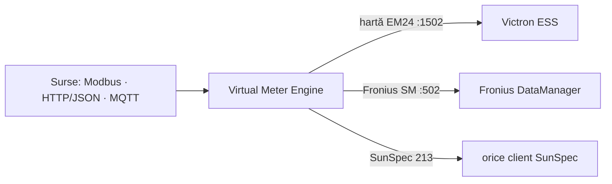
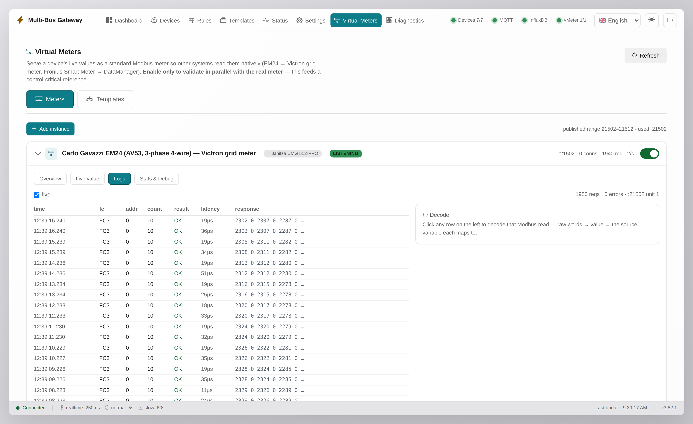

# Multi-Bus Gateway

> **Ancestry.** Multi-Bus Gateway 3.0.0 is the direct successor of the
> *Janitza UMG 512 Modbus/MQTT monitor* project — the same field-tested
> engine, generalized into a protocol gateway: multiple southbound sources
> (Modbus TCP/RTU, HTTP/JSON, MQTT), device-template catalog, composite
> virtual meters with an in-band quality convention, and an operator UI
> with commissioning diagnostics. The Janitza UMG 512-PRO remains a
> first-class supported device (bundled template + verified register map).

> fost *Janitza UMG 512-PRO Monitor* — gateway de protocol multi-sursă:
> Modbus TCP/RTU · HTTP/JSON · MQTT → MQTT / InfluxDB / metere Modbus
> virtuale / HTTP-JSON / REST

🇷🇴 **Română** | [🇬🇧 English](README.en.md)

[](https://github.com/sm26449/multi-bus-gateway/releases)
[](https://github.com/sm26449/multi-bus-gateway/pkgs/container/multi-bus-gateway)


[](LICENSE)

> **Gateway de protocol software — achiziție, verificare, monitorizare și
> rutare de date. Retrofit, nu înlocuire.**

Citește contoare și senzori existenți — prin **Modbus TCP**, **Modbus RTU**,
**HTTP/JSON** (Solar API, Shelly, Tasmota…) sau **MQTT** — și rutează datele
către **MQTT, InfluxDB/Grafana, Home Assistant, REST și feed-uri JSON**. În
plus, unic: re-servește sursele fizice ca **metere Modbus virtuale**
(Carlo Gavazzi EM24, Fronius Smart Meter, SunSpec), astfel încât Victron,
Fronius și orice PLC/SCADA văd fiecare meterul pe care îl așteaptă. Totul
într-un container, pe hardware pe care îl deții.

- 🔌 **Retrofit în loc de înlocuire** — digitalizezi echipamente deja
  instalate; **zero hardware nou**.
- 🧩 **Multi-sursă, multi-sink** — fiecare dispozitiv cu rutarea lui proprie
  (topic MQTT, bucket InfluxDB, ieșiri opt-in), pipeline-uri independente.
- 🪞 **Un meter, mai mulți consumatori** — metere virtuale emulate, cu
  politici explicite de staleness și bloc de calitate in-band.
- 🛠️ **UI de operator** — wizard cu discovery, diagnostice la nivel de
  cadru, snapshot-uri de configurație cu rollback, roluri și audit.

> **Scop asumat:** e un **gateway de protocol**, nu o aplicație de
> energie/raportare — costuri, tarife, facturare și analize rămân treaba
> sistemelor din aval.

📖 **[Manual de utilizare](docs/MANUAL.ro.md)** ·
🏗️ **[Arhitectură (diagrame)](docs/architecture.md)** ·
🔌 **[Referință API](docs/API.md)** ·
📡 **[Spec meter virtual](docs/virtual-meter-spec.md)** ·
🗂️ **[Catalog de dispozitive](docs/device-catalog.md)** ·
🖼️ **[Ghid vizual UI](docs/GHID-UI.md)**

## De ce software, nu o cutie?

Un aparat Modbus-to-MQTT dedicat e o variantă. Asta e cealaltă: aceeași
treabă în software pe care îl deții și îl poți extinde — pe hardware pe care
îl ai deja, sau pe un Raspberry Pi de ~50€ cu un adaptor USB/HAT RS-485,
montabil pe șină DIN la fel de bine. Fără lock-in, fără cost per cutie.

- ⚡ **Polling sub-secundă configurabil** — reglabil per poll-group, fără
  prag fix (rulăm 250 ms pe grupul realtime); gateway-urile cu funcție fixă
  se opresc de obicei la ~5 s.
- ♾️ **Fără limite de dispozitive / valori** — mărginit doar de host.
- 🪞 **Metere virtuale** — un gateway read-only nu poate re-servi datele ca
  device-uri emulate; acesta poate.
- 🔓 **Sursă deschisă, hardware de comodă** — îl inspectezi, îl forkezi, îi
  adaugi un protocol.
- 🍓 **Frugal, măsurat pe hardware limitat** — ~90 MB RAM și câteva procente
  CPU la o instalare tipică, fără scurgeri. Un **RPi 3 rulează confortabil
  ~4–5 dispozitive + ~3 metere virtuale** (realtime ≥ 1 s), un Pi 4/5 mult mai
  mult. Plicul de capacitate complet + profilul recomandat: [MANUAL §18b](docs/MANUAL.ro.md#18b-rulare-pe-hardware-limitat-raspberry-pi).

## Caracteristici (3.0.0)

**Southbound (achiziție)**
- **Modbus TCP** și **Modbus RTU master** (serial RS-485), cu citiri batch,
  retry-uri și taxonomie de erori (`timeout` / `exception_N` / `connection`).
- **HTTP/JSON** — orice endpoint JSON, cu `json_path` per registru și gardă
  SSRF (doar LAN privat, implicit).
- **MQTT-in** — abonare la un broker; valoare din payload JSON (`json_path`)
  sau payload brut; topic per registru cu wildcard-uri `+`/`#`.
- **Template-uri de dispozitiv** — harta de registre ca fișier JSON portabil;
  10 hărți incluse, field-tested, cu proveniență documentată
  ([catalog](docs/device-catalog.md)): Janitza UMG 512-PRO (4.126 registre),
  ABB B21/B23, Carlo Gavazzi EM24, Eastron SDM120/SDM630, Schneider iEM3000
  + 3 hărți MQTT (Zigbee2MQTT, Theengs BLE, JSON generic). Editor + upload +
  export + **import CSV** ([ghid](docs/csv-import.md)).
- **Wizard cu discovery** — scanare CIDR pe portul Modbus, sweep de unit-ID
  (TCP și RTU), **SunSpec model walk**, răsfoire de topicuri MQTT cu preview,
  Fronius Solar API discover; „Use" pre-completează wizard-ul.

**Măsurători**
- Registre selectate per dispozitiv, **grupuri de poll**
  (realtime/normal/slow, intervale 0,05 s–24 h, hot-reload).
- **Registre calculate** — motor de expresii sigur (AST whitelist) cu
  `prev()` și `dt` pentru rate (`(E - prev(E)) / dt * 3600`), referințe între
  dispozitive, preview live, preset-uri reutilizabile; curg către toate
  ieșirile.
- **Praguri** de colorare per registru (warning/danger) pe dashboard.

**Northbound (sink-uri) — toate opt-in, per dispozitiv**
- **MQTT** — moduri `changed`/`all`, retain/QoS, TLS/mTLS, Last-Will,
  **Home Assistant autodiscovery** (device-uri separate per sursă,
  `unique_id` stabil `mbg_dev_*`).
- **InfluxDB** — bucket per dispozitiv (auto-creat), timestamp = ora citirii,
  **buffer store-and-forward persistat pe disc** (zero pierderi la pană,
  replay idempotent cu timestamp-urile originale).
- **REST push** — POST periodic de telemetrie JSON către un URL/webhook,
  format `native`/`flat`, headere de auth mascate, fără redirecturi.
- **HTTP/JSON output** — valorile live ca feed read-only la
  `GET /api/meters/<id>` (stil Solar API).

**Metere virtuale**
- Emulări: **Carlo Gavazzi EM24** (Victron), **Fronius Smart Meter TS**,
  **SunSpec 213** — plus orice template YAML propriu.
- **Compozite multi-sursă**: rânduri din mai multe dispozitive
  (`dispozitiv.registru`), sume, constante; prag de prospețime per rând.
- **Politici de staleness** (`legacy`/`fail`/`sentinel`/`hold`) — absența nu
  se servește niciodată ca 0/false; sumele preiau calitatea celui mai slab
  membru.
- **Bloc de calitate in-band la 61440** (convenția v1) — starea datelor pe
  aceeași conexiune Modbus ([spec](docs/virtual-meter-spec.md)).
- Observabilitate completă: jurnal cu ultimele 1024 de query-uri, statistici,
  decode pe interval de adrese, watchdog de prospețime (sursă stale → serverul
  tace, fail-safe-ul consumatorului preia).

**Diagnostice (punere în funcțiune)**
- **Bus monitor** la nivel de cadru — hex TX/RX, decodare, latență,
  **fiecare retry ca intrare separată**; ring RAM-only, oprit implicit.
- **Register probe** — matrice tip de date × ordine de cuvinte
  (ABCD/CDAB/BADC/DCBA), hex + ASCII: bancul de lucru pentru endianness.
- **Payload sample** pentru picker-ul `json_path`; **scanare SunSpec**.

**Siguranța configurației**
- **Snapshot-uri automate** la fiecare modificare (50 păstrate) + manuale,
  **diff semantic** între snapshot-uri, **rollback** reversibil,
  **last-known-good boot seatbelt** (un config.yaml stricat e restaurat
  automat la boot).
- **Backup export/import ZIP** — secretele eliminate implicit; import cu
  merge (secretele supraviețuiesc).

**Securitate (totul opt-in, implicit LAN de încredere)**
- **Login** cu sesiuni + lockout per IP; **roluri admin / operator / viewer**
  (operator = acțiuni live, fără modificări de configurație).
- **Passkeys (WebAuthn)** — cer context securizat (localhost sau hostname
  peste HTTPS).
- **Audit trail** JSONL rotit (login-uri, scrieri, exporturi; payload-uri
  redactate), **cheie API** (`X-API-Key`), **allowlist de IP-uri**,
  `ui.trusted_proxies` pentru reverse proxy (Traefik), HTTPS încorporat,
  **redirect spre adresa canonică** (`ui.canonical_url`, portiță `?local`).
- **Scrieri Modbus gated** — oprite implicit, allowlist din template cu
  `write_min`/`write_max`, **lease-uri dead-man crash-safe** (revert automat
  la `write_safe`), dispozitivul primar mereu read-only.

**Observabilitate & UX**
- **`/metrics` Prometheus** (serii device/sink/vmeter), pagina **Status** cu
  taxonomia erorilor, **jurnal de evenimente persistat**, `/health` corect
  pentru probe de container.
- **Alerte de infrastructură** pe MQTT + webhook ([ghid](docs/alerts-webhooks.md)).
- **i18n EN+RO** (limbile = fișiere `ui/languages/*.json`, fără rebuild),
  **fus orar configurabil** pentru rapoartele lunare, WebSocket real-time,
  hot-reload aproape peste tot.

## 🔌 Metere virtuale

Un singur meter la punctul de racord măsoară tot. Dar Victron vrea un
*Carlo Gavazzi EM24*, Fronius vrea un *Fronius Smart Meter*, altul vrea
SunSpec. În loc să cumperi trei metere, le **definești ca template-uri** și
le servești pe toate din sursele pe care le ai deja — fiecare ca server
Modbus-TCP izolat, alimentat din valorile live.



**Două moduri:** ① rulezi *în paralel* cu meterul real ca să validezi fără
risc, apoi ② *consolidezi* — meterul virtual îl înlocuiește pe cel fizic. Cu
observabilitate completă (query log) tot drumul — exact instrumentul cu care
am făcut reverse-engineering la protocolul Fronius Smart Meter.

### Metere compozite (agregator multi-sursă)

Un meter virtual poate aduna registre din **mai multe surse deodată** —
meter Modbus + invertor HTTP + senzori MQTT — într-o singură hartă Modbus
TCP și într-un feed JSON (`/api/virtual-meters/<id>/values`): un PLC/SCADA
citește totul dintr-un singur poll.

**Convenția de staleness** (absența nu se servește NICIODATĂ ca 0/false —
o valoare înghețată poate conduce greșit o buclă de control):

| Politică (`on_stale`) | Registru stale/lipsă | Folosire |
|---|---|---|
| `legacy` (implicit) | comportamentul clasic single-source: un singur watchdog pe instanță | meterele existente — neatinse |
| `fail` | citirea care îl atinge → **excepție Modbus**; blocurile peste el sunt refuzate (fără adevăr parțial) | consumatori de control (Victron, PLC) |
| `sentinel` | **N/A SunSpec**: float→NaN, int16→0x8000, uint16→0xFFFF… | consumatori care înțeleg santinelele |
| `hold` | ultima valoare, plafonat la `max_hold_s`, apoi ca `fail` | display-uri tolerante |

Sumele preiau calitatea **celui mai slab** membru — niciodată sume parțiale.
Opțional, **blocul de calitate in-band la 61440** pune starea datelor chiar
pe conexiunea Modbus ([spec](docs/virtual-meter-spec.md)).



## Instalare rapidă

```bash
git clone https://github.com/sm26449/multi-bus-gateway.git
cd multi-bus-gateway
cp .env.example .env          # opțional — totul se poate seta din UI
docker compose up -d
# UI: http://localhost:8080
```

### Imaginea prebuilt (fără build local)

O imagine multi-arch (amd64 + arm64, inclusiv Raspberry Pi) este publicată în
GitHub Container Registry la fiecare release:

```bash
docker run -d --name multi-bus-gateway --restart unless-stopped \
  -p 8080:8080 -p 1502-1512:1502-1512 -p 502:502 \
  --env-file .env -v "$PWD/config:/app/config" \
  ghcr.io/sm26449/multi-bus-gateway:latest
```

> **Porturi:** `8080` = Web UI · `1502-1512` = metere virtuale (extinde cu
> `VMETER_PORT_START/END`) · `502` = portul Modbus standard pe care unii
> consumatori îl interoghează (scoate-l dacă e ocupat pe host). Pentru RTU
> treci adaptorul serial în container (`devices:` în compose). Ghid complet:
> [docs/MANUAL.ro.md](docs/MANUAL.ro.md).

### Cu InfluxDB și Grafana (opțional)

```bash
docker compose --profile influxdb --profile grafana up -d
```

## Configurare

> **Poți configura tot din UI.** Conexiunile dispozitivelor, MQTT și InfluxDB
> sunt editabile live — salvate în `config/config.yaml` (volum montat) și
> aplicate **fără restart**. Variabilele `.env` sunt **opționale**: doar
> pre-populează un deploy nou sau fixează valori într-un setup imutabil. O
> setare dată prin env are întâietate și apare **blocată** în UI.

Esențialul din `.env` (lista completă în [manual](docs/MANUAL.ro.md#3-prima-configurare)):

```bash
MODBUS_HOST=192.168.1.100     # dispozitivul primar
MQTT_BROKER=mosquitto
INFLUXDB_ENABLED=false
UI_PORT=8080
API_KEY=                      # opțional: cere X-API-Key la modificări
```

Fișiere sub `config/` (volum): `config.yaml` (tot ce e global + devices),
`selected_registers.json` + `devices/<id>/selected_registers.json` (selecțiile
de registre), `templates/` (template-uri vmeter), `virtual_meters.yaml`
(instanțe), `snapshots/` (snapshot-uri automate), `audit.jsonl`,
`events.jsonl`, `passkeys.json`.

## Interfața web

Patru zone principale — **Dashboard** (global), **Devices** (workspace per
dispozitiv: Overview / Edit / Registers / Calculated / Outputs / Monitor /
History / Energy), **Virtual Meters**, **Diagnostics**, **Status** și
**Config**. Tot ce ține de un singur dispozitiv stă în workspace-ul lui, nu
într-un meniu global. Tur complet, tab cu tab: [manual §4](docs/MANUAL.ro.md#4-interfața-web-tab-cu-tab).

## API

Peste 100 de endpoint-uri REST + WebSocket, grupate pe domenii (dispozitive,
registre, metere virtuale, diagnostice, configurație, snapshot-uri, audit,
metrics), fiecare cu rolul minim necesar — referința completă, generată din
cod: **[docs/API.md](docs/API.md)**.

```bash
curl -s http://localhost:8080/api/status | jq .devices
curl -s http://localhost:8080/metrics | grep gateway_device_up
```

## Securitate

Implicit, appliance-ul e gândit pentru un **LAN de încredere** — totul e
deschis local și fiecare strat de apărare e opt-in:

- **Login + roluri** (admin/operator/viewer), lockout per IP, **passkeys
  WebAuthn**, sesiuni HttpOnly glisante 7 zile.
- **Cheie API** (`API_KEY` → `X-API-Key` pe modificări), **allowlist de
  IP-uri**, **HTTPS** încorporat sau prin reverse proxy cu
  `ui.trusted_proxies` (Traefik), **adresă canonică** (`ui.canonical_url`)
  cu portița `?local`.
- **Scrieri Modbus** oprite implicit și, chiar activate, permise doar pe
  registre declarate writable în template, cu limite și lease-uri dead-man;
  **audit trail** pentru tot.
- Gărzi SSRF pe fetch-urile server-side, redirecturi refuzate, CSRF pe
  origin, secrete redactate din loguri și backup-uri.

Detalii și pași concreți: [manual §16](docs/MANUAL.ro.md#16-securitate).

## Structura proiectului

```
multi-bus-gateway/
├── config/                    # Volumul de configurație (exemple incluse)
├── docs/                      # Manual EN/RO, arhitectură, API, spec-uri
├── multibus/                  # Pachetul Python (motorul gateway-ului)
│   ├── api.py                 # REST API + WebSocket (FastAPI)
│   ├── routes/                # Rutele pe domenii
│   ├── modbus_client.py       # Driver Modbus TCP/RTU
│   ├── http_client.py         # Driver HTTP/JSON
│   ├── mqtt_input.py          # Driver MQTT-in
│   ├── mqtt_publisher.py      # Sink MQTT + HA discovery
│   ├── influxdb_publisher.py  # Sink InfluxDB + buffer
│   ├── rest_push.py           # Sink REST push
│   ├── virtual_meter*.py      # Motorul de metere virtuale
│   ├── calc_engine.py         # Registre calculate
│   ├── device_templates/      # Hărțile de registre incluse
│   ├── snapshots.py           # Snapshot-uri + LKG seatbelt
│   ├── auth.py / passkeys.py  # Login, roluri, WebAuthn
│   ├── audit.py / event_log.py
│   └── bus_trace.py / discovery.py / alerts.py …
├── ui/                        # SPA vanilla JS (i18n în ui/languages/)
├── tests/                     # Suita de teste (pytest)
├── main.py                    # Entry point
├── Dockerfile / docker-compose.yml
└── CHANGELOG.md
```

## Integrare pv-stack (Docker Services Manager)

Pentru deploy în stack-ul pv-stack cu mosquitto și influxdb partajate:

```bash
cp -r multi-bus-gateway/* docker-setup/templates/multi-bus-gateway/
docker compose -f docker-compose.pv-stack.yml build multi-bus-gateway
docker compose -f docker-compose.pv-stack.yml up -d multi-bus-gateway
```

Variabilele de mediu sunt **fără prefix** (aplicația citește `MODBUS_HOST`)
și toate sunt **opționale** — de preferat le setezi din UI. `API_KEY` e
acceptat și ca `JANITZA_API_KEY` (compatibilitate istorică).

## Dezvoltare

```bash
python3 -m venv venv && source venv/bin/activate
pip install -r requirements.txt
python main.py --debug

# teste (în containerul imaginii)
docker run --rm -v "$(pwd)":/app -w /app --entrypoint sh \
  multi-bus-gateway:latest -c "python -m pytest -q"
```

## Contributing

Ai găsit un bug sau vrei o funcționalitate? Deschide un issue pe
[GitHub Issues](https://github.com/sm26449/multi-bus-gateway/issues).
Hărțile de registre contribuite (template-uri, CSV) sunt binevenite — cu
proveniență verificabilă, vezi [docs/device-catalog.md](docs/device-catalog.md).

## Authors

**Stefan Maldaianu** - [sm26449@diysolar.ro](mailto:sm26449@diysolar.ro)

**Claude** (Anthropic) - Pair programming partner

## License

**GNU Affero General Public License v3.0 (AGPL-3.0)** — software liber și
open source.

Copyright (c) 2024-2026 Stefan Maldaianu <sm26449@diysolar.ro>

Poți folosi, studia, modifica și distribui acest software, **inclusiv
comercial**. Condiția AGPL: dacă distribui versiuni modificate — sau le
oferi ca **serviciu în rețea** (SaaS) — trebuie să pui la dispoziția
utilizatorilor **codul sursă complet**, sub aceeași licență. Termeni
compleți în [LICENSE](LICENSE) ·
<https://www.gnu.org/licenses/agpl-3.0.html>

---

**Disclaimer**: Acest software este furnizat „ca atare", fără nicio
garanție. Folosește-l pe propriul risc când monitorizezi sisteme energetice
critice.
