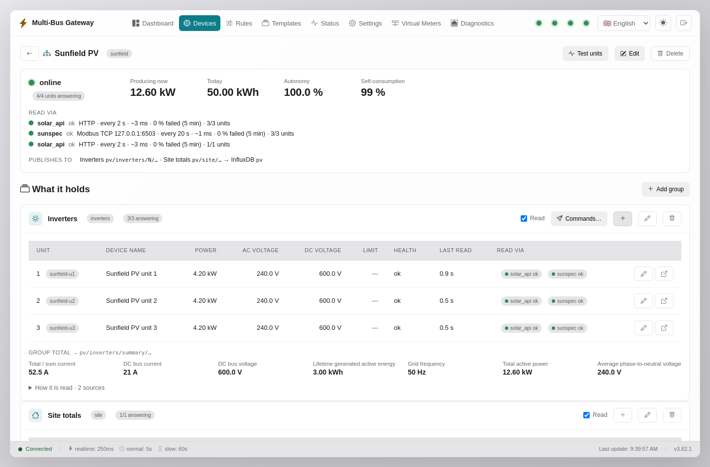
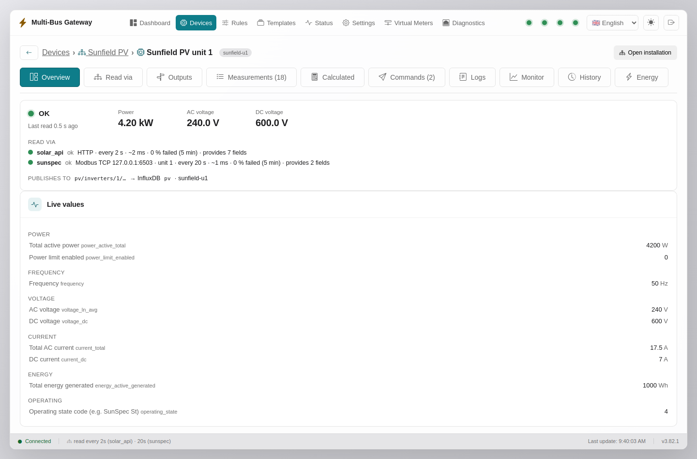
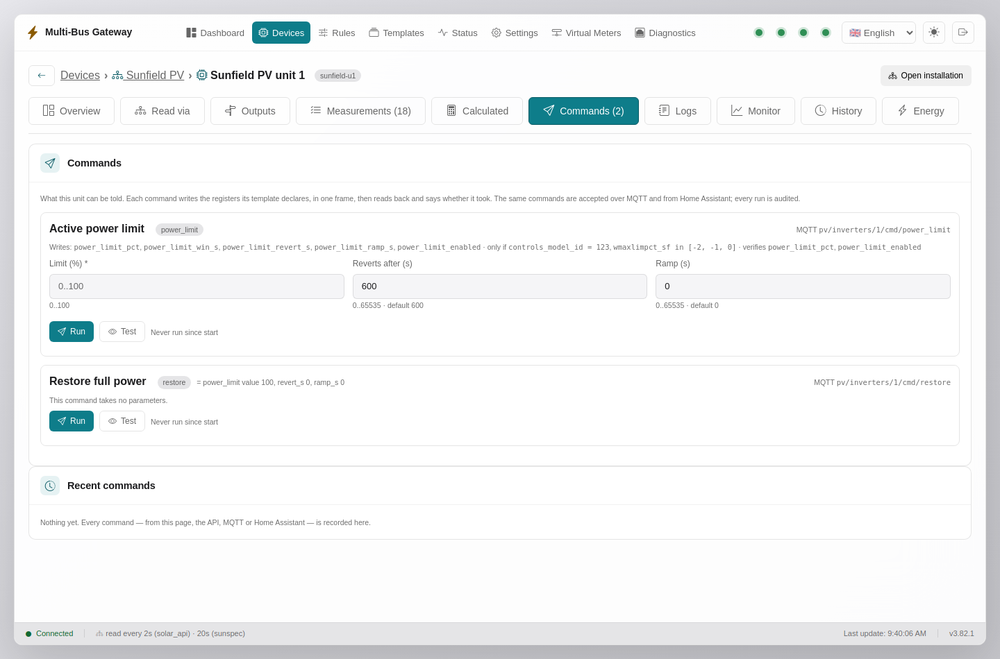
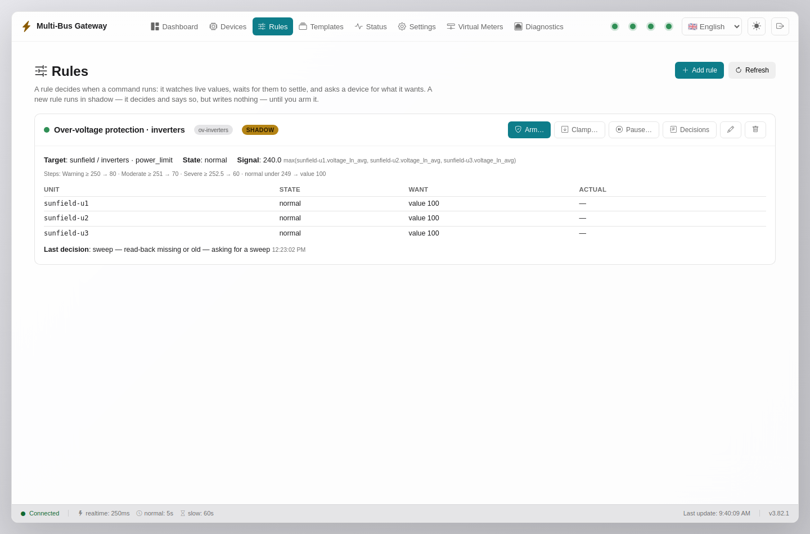

# Ghid vizual al interfeței — Multi-Bus Gateway

> Ghid în română, cu capturi din versiunea 3.82 (septembrie 2026): include
> instalațiile cu mai multe unități, pagina unei unități, comenzile și regulile
> (§19–§22). Referința completă, la zi, este [MANUAL.md](MANUAL.md) (engleză).

Un tur ilustrat al fiecărei pagini, sub-pagini și tab din interfața web, cu note
explicative pentru operator/integrator. Capturile sunt făcute pe o **instanță
demo completă** cu date vii (simulatoare de metere Modbus din `loadtest/`,
broker MQTT + InfluxDB efemere, conturi demo): un meter principal Janitza și
două EM24 pe Modbus TCP, o instalație Fronius cu trei invertoare citite prin
Solar API și SunSpec (simulate) plus totalurile de site, un meter virtual EM24
servit mai departe și o regulă în mod shadow — exact fluxul unui deployment
real, fără nicio informație de producție. Bara de sus e identică peste tot: navigarea între pagini,
indicatorii de stare (dispozitive / MQTT / InfluxDB / vmeter — verde = ok),
selectorul de limbă și comutatorul de temă (clar/întunecat).

---

## 1. Dashboard

Panoul de ansamblu. Sus, patru contoare rapide: **măsurători active**, **rata de
poll** (updates/sec), **mesaje MQTT publicate**, **puncte scrise în InfluxDB**.

Dedesubt, **Live Values** — valorile în timp real, grupate pe **chip-uri de
dispozitiv** (aici *Janitza UMG 512-PRO* și *Fronius Meter*): apeși un chip și
vezi doar widget-urile acelui dispozitiv. Fiecare widget arată valoarea, unitatea
și numele registrului; unele au **gauge** (tensiuni), altele **sparkline** (trend)
sau **badge de grup de poll** (realtime / normal / slow). Butoanele din dreapta:
comută între **grilă și tabel**, ascunde/afișează unitățile, și **Customize**
(reordonare, culori, alegerea widget-urilor). Bara de jos: starea conexiunii,
intervalele grupurilor de poll, versiunea și ora ultimului update.

---

## 2. Monitor live (tab-ul Monitor al unei unități)

Din 3.5x, Monitor și History sunt tab-uri în **spațiul de lucru al unității**
(Devices → unitate), nu pagini separate. Monitor desenează în timp real până la
șase valori alese din lista din stânga (căutare instant, grupate pe categorii),
cu min/max și zoom; tabelul de sub grafic arată valoarea curentă a fiecărei
măsurători urmărite. Lista completă a măsurătorilor, cu editare (adresă Modbus,
`json_path` pentru HTTP/MQTT, grup de poll), este în tab-ul **Measurements**.

---

## 3. Istoric (tab-ul History al unei unități)

Grafice pe intervale din datele stocate în InfluxDB — alegi registrele de afișat
din lista din stânga, fereastra de timp (1 h … 90 d) și pasul de agregare. Util pentru a vedea evoluția (tensiuni, putere) fără a
deschide Grafana. Comparațiile sunt pe aceeași unitate (axă comună corectă).

---

## 4. Dispozitive (Devices)

Toate sursele, cu sănătatea live a fiecăreia: dispozitivele de sine
stătătoare (aici meterul principal Janitza și cele două EM24) și
**instalațiile** (aici „Sunfield PV”), ale căror unități stau grupate sub rândul
instalației, cu pe ce cale sunt citite (`solar_api` HTTP la 2 s + `sunspec`
Modbus TCP la 20 s). Fiecare rând arată protocolul, adresa, starea de conectare,
numărul de măsurători și unde publică (topic MQTT, bucket InfluxDB). De aici
**adaugi un dispozitiv** (wizard-ul din §18), **adaugi o instalație** (wizard
în patru pași: adresa datalogger-ului, ce s-a găsit pe el, cadențe, revizuire),
**editezi** conexiunea sau intri în spațiul de lucru al unei unități (§20).
Butonul de deschidere de pe rândul instalației duce la pagina ei (§19).

---

## 5. Template-uri (Templates)

Catalogul de hărți de dispozitiv — profilele field-verified (Janitza, Eastron
SDM120/630, ABB, Schneider, Carlo Gavazzi EM24, presetări Zigbee/BLE/MQTT). Un
template descrie harta de registre + protocolul + categoriile. De aici
**încarci** un template nou (JSON/CSV), **exporți**, sau **creezi/editezi** unul.
Fiecare device se leagă de un template — de acolo își ia catalogul de registre.

---

## 6. Stare (Status)

Sănătatea sistemului la un loc: per dispozitiv (rata de poll, latență, ultima
citire, **taxonomia erorilor** — timeout / excepție_N / conexiune), starea
sink-urilor (MQTT/InfluxDB conectate, rate, buffer store-and-forward), metere
virtuale, și **jurnalul de evenimente** recent. E prima pagină la care te uiți
când ceva nu merge — îți spune *care strat* e bolnav.

---

## 7. Metere virtuale (Virtual Meters)

Emulările Modbus TCP servite mai departe (un consumator citește gateway-ul ca pe
un meter fizic). Fiecare instanță arată template-ul emulat (EM24, Fronius TS…),
portul, starea, rata de cereri și conexiunile active. De aici configurezi
**politica de staleness** (legacy / fail / sentinel / hold — absența nu e
niciodată servită ca 0) și **blocul de calitate in-band** (registrele 61440).
Subtab-urile arată preview-ul valorilor și statistici/debug de comunicație.

---

## 8. Diagnostics — Monitor magistrală

Trace Modbus **la nivel de frame** — octeții exacți de pe fir, un rând per
tranzacție (fiecare retry inclus). Pornești captura, filtrezi pe dispozitiv, și
vezi FC, adresa, rezultatul (OK / excepție / timeout / CRC), latența. Un click pe
rând deschide frame-urile brute segmentate (MBAP / PDU / CRC). Runtime only —
bufferul e în memorie, captura se oprește la restart. Instrumentul #1 la
comisionarea unui bus nou.

---

## 9. Diagnostics — Sondă registru (endianness)

Citire one-shot pe **orice** dispozitiv Modbus, cu **toate interpretările una
lângă alta** — tip de date × ordine de cuvinte (ABCD / CDAB / BADC / DCBA).
Coloana care dă o valoare plauzibilă e ordinea corectă a dispozitivului — o
setezi ca `byte_order` în template. Rezolvă în secunde „ghicește word order-ul"
la un meter necunoscut. Afișează și hex-ul brut + ASCII.

---

## 10. Diagnostics — Scanare SunSpec

Parcurge lanțul de modele SunSpec al unui invertor/meter (markerul SunS, apoi
fiecare model declarat de dispozitiv) — identitate (producător, model, serie),
metere, MPPT, stocare. Doar citire; enumerează ce declară device-ul, nu
fabrichează nimic. Onboarding aproape automat pentru invertoarele Fronius / SMA /
SolarEdge / Huawei.

---

## 11. Settings — MQTT

Conexiunea la broker (adresă, port, user/parolă, TLS), modul de publicare
(*changed* / *all*), retain/QoS, și **Home Assistant discovery**. Rutarea per
device (topicuri, prefixe) trăiește pe device, nu aici — aici e doar conexiunea
brokerului. Salvarea aplică live (reconectare).

---

## 12. Settings — InfluxDB

Conexiunea la InfluxDB (URL, token, org, bucket), intervalul de scriere și modul
de publicare. Include **buffer-ul store-and-forward**: dacă InfluxDB pică,
punctele se țin (în RAM + opțional pe disc) și se rejoacă cu timestamp-ul original
la reconectare — fără gap-uri false.

---

## 13. Settings — Backup & Restore + Snapshot-uri

Sus: **export/import** al întregii configurații ca ZIP (secretele excluse
implicit). Dedesubt: **Snapshot-uri & Rollback** — un snapshot al configurației se
face automat după fiecare schimbare; poți face rollback la orice moment (starea
curentă se salvează întâi, deci e reversibil), vezi **diff-ul semantic** față de
prezent, descarci sau ștergi. „Last known good" se restaurează automat dacă
configurația nu se mai încarcă la boot.

---

## 14. Settings — Securitate

**IP allowlist**, **adresa canonică** (redirect spre `https://…` cu portița
`?local`), **HTTPS** pentru UI, **login + roluri** (admin / operator / viewer),
lockout, **passkeys (WebAuthn)** și scrierile Modbus (gate cu limite din template).
E panoul de la care pornești securitatea când cutia iese din LAN-ul de încredere.

---

## 15. Settings — Securitate: Jurnal de audit

**Jurnalul de audit** (partea de jos a paginii de securitate): cine a schimbat
ce, când, de la ce IP — cu payload-ul redactat. Filtrabil, exportabil CSV.
Include login-uri (ok/greșit/lockout), scrieri pe dispozitive, exporturi de
secrete. Fiecare refuz (403) apare pe numele contului care l-a încercat.
**Doar rolul admin** poate citi conținutul: captura de aici e vederea unui
*operator*, unde tabelul afișează „The audit trail requires the admin role" —
adică exact gate-ul de rol în acțiune.

---

## 16. Settings — Alerte

Reguli de alertă locale + webhook-uri: dispozitiv căzut/revenit, latență, buffer
InfluxDB. (Notificările „grele" — SMS/Telegram — trăiesc în serviciul de alerte
separat; aici sunt semnalele de bază ale gateway-ului.)

---

## 17. Settings — General

Parametri de sistem: fusul orar, culorile default de fază (convenție IEC / RST /
distinct), și alte setări globale de UI.

---

## 18. Wizard adăugare dispozitiv — pasul 1 (Conexiune)

Fluxul ghidat de adăugare a unui dispozitiv, în 3 pași. **Pasul 1 — Conexiune**:
alegi protocolul (Modbus TCP / RTU / HTTP/JSON / MQTT) și completezi parametrii
(IP+port / port serial+baud / URL / broker+topic). Butonul **Test connection**
verifică live înainte de a salva; pentru MQTT ai și **Browse topics** (alegi
topicul din ce publică brokerul, nu-l tastezi orb). Pasul 2 alege template-ul
(harta de registre), pasul 3 configurează rutarea (MQTT/InfluxDB/vmeter).

---

## 19. Pagina instalației

O **instalație** este un datalogger cu grupurile lui: aici trei invertoare și
totalurile de site. Cardul de sus spune dacă e online, câte unități răspund,
producția de acum, energia de azi, autonomia, și **pe ce căi este citită**
(fiecare sursă cu cadență, latență și procentul de citiri eșuate din ultimele
5 minute) și unde publică. Sub „What it holds”, fiecare grup are tabelul
unităților (putere, tensiuni AC/DC, limită activă, sănătate, ultima citire, pe
ce sursă răspunde), totalurile grupului publicate pe `pv/inverters/summary/…`
și, când template-ul le oferă, butonul **Commands…** care trimite aceeași
comandă tuturor unităților grupului.

---

## 20. Spațiul de lucru al unei unități

Fiecare unitate a unei instalații are propria pagină, cu tab-uri: Overview
(starea, sursele care o alimentează și câte câmpuri aduce fiecare, valorile
live grupate pe categorii), Read via, Outputs, Measurements, Calculated,
Commands, Logs, Monitor, History, Energy. Firul de navigare din antet duce
înapoi la instalație și la lista de dispozitive.

---

## 21. Comenzi (tab-ul Commands)

Comenzile pe care template-ul le declară pentru această unitate — aici limita
de putere activă a unui invertor SunSpec și „Restore full power”. Fiecare card
spune ce registre scrie, sub ce condiții de gardă (`controls_model_id = 123`)
și ce verifică la citirea înapoi; parametrii au limite și valori implicite.
**Test** face o rulare pe uscat, **Run** cere confirmare. Aceleași comenzi
sunt acceptate pe MQTT (`…/cmd/power_limit`) și din Home Assistant; fiecare
rulare apare în „Recent commands” și în jurnalul de audit.

---

## 22. Reguli

O regulă urmărește o valoare live (aici maximul tensiunilor celor trei
invertoare), așteaptă să se stabilizeze și cere unui grup sau unei unități o
comandă: trepte (`steps`, ca aici: peste 250 V limita coboară la 80 %, peste
251 V la 70 %, peste 252,5 V la 60 %, revine sub 249 V) sau o condiție. O
regulă nouă rulează în **shadow** — decide și spune ce ar face, dar nu scrie
nimic — până o **armezi**. Tabelul arată per unitate starea, ce vrea regula și
ce a citit înapoi; „Decisions” deschide istoricul deciziilor, „Clamp…” și
„Pause…” sunt intervențiile operatorului.

---

## Note

- **Roluri**: un *viewer* vede toate paginile (read-only); un *operator* poate
  folosi uneltele de comisionare și scrie pe dispozitive, dar nu schimbă
  configurația; un *admin* poate tot, inclusiv audit-ul și securitatea.
- **Temă**: comutatorul soare/lună (dreapta-sus) schimbă clar/întunecat; UI-ul
  respectă și preferința sistemului.
- **Limbă**: EN + RO incluse; se adaugă altele copiind un fișier din
  `ui/languages/`.

*Capturi generate pe versiunea 3.82, pe o instanță demo efemeră
(simulatoare de metere și invertoare + broker/Influx de unică folosință,
Playwright la 1440×950, login demo) cu
`tools/e2e/capture_docs_screenshots.mjs`. Când UI-ul se schimbă vizibil,
re-generează-le la fel — mediul demo se ridică în câteva minute și
capturile rămân publicabile (zero date de producție).*
