# Ghid vizual al interfeței — Multi-Bus Gateway

Un tur ilustrat al fiecărei pagini, sub-pagini și tab din interfața web, cu note
explicative pentru operator/integrator. Capturile sunt făcute pe o **instanță
demo completă** cu date vii (simulatoare de metere Modbus din `loadtest/`,
broker MQTT + InfluxDB efemere, conturi demo): trei surse Modbus TCP —
un meter principal și două EM24 — plus un meter virtual EM24 servit mai
departe, exact fluxul unui deployment real, fără nicio informație de
producție. Bara de sus e identică peste tot: navigarea între pagini,
indicatorii de stare (dispozitive / MQTT / InfluxDB / vmeter — verde = ok),
selectorul de limbă și comutatorul de temă (clar/întunecat).

---

## 1. Dashboard

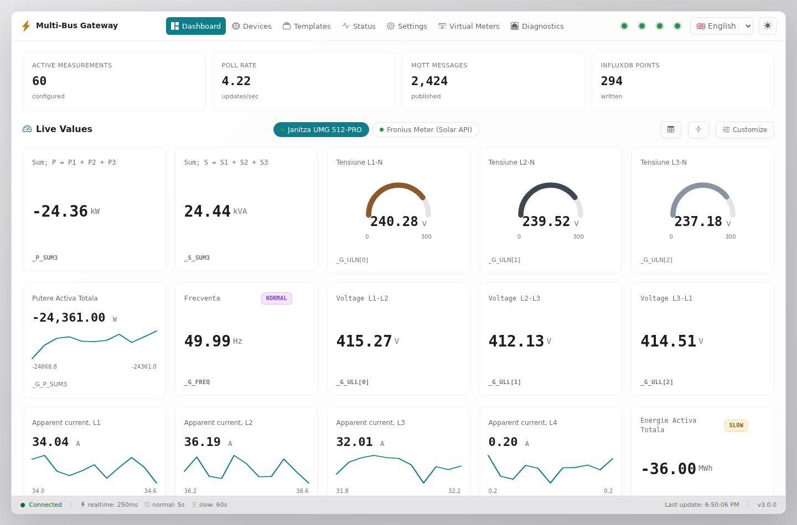

Panoul de ansamblu. Sus, patru contoare rapide: **măsurători active**, **rata de
poll** (updates/sec), **mesaje MQTT publicate**, **puncte scrise în InfluxDB**.

Dedesubt, **Live Values** — valorile în timp real, grupate pe **chip-uri de
dispozitiv** (aici *Janitza UMG 512-PRO* și *Fronius Meter*): apeși un chip și
vezi doar widget-urile acelui dispozitiv. Fiecare widget arată valoarea, unitatea
și numele registrului; unele au **gauge** (tensiuni), altele **sparkline** (trend)
sau **badge de grup de poll** (realtime / normal / slow). Butoanele din dreapta:
comută între **grilă și tabel**, ascunde/afișează unitățile, și **Customize**
(reordonare, culori, alegerea widget-urilor). Bara de jos: starea conexiunii,
intervalele grupurilor de poll, versiunea și ora ultimului update.

---

## 2. Măsurători (Monitor)

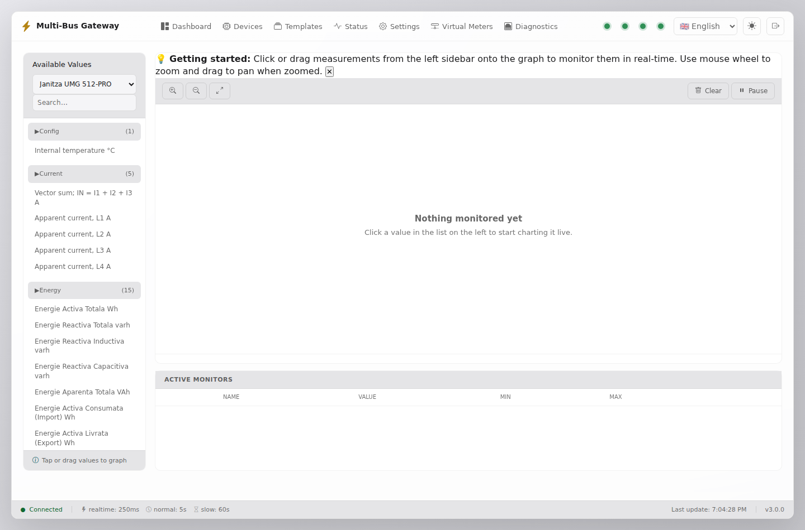

Lista completă a măsurătorilor selectate pentru dispozitivul curent, în format
tabelar — nume, valoare, unitate, adresă/registru, grup de poll. E vederea de
lucru: cauți un registru, îl vezi actualizându-se live. Selectorul de dispozitiv
(sus) schimbă contextul; căutarea filtrează instant. De aici editezi o măsurătoare
sau adaugi una nouă (adresă Modbus, json_path pentru HTTP/MQTT).

---

## 3. Istoric (History)

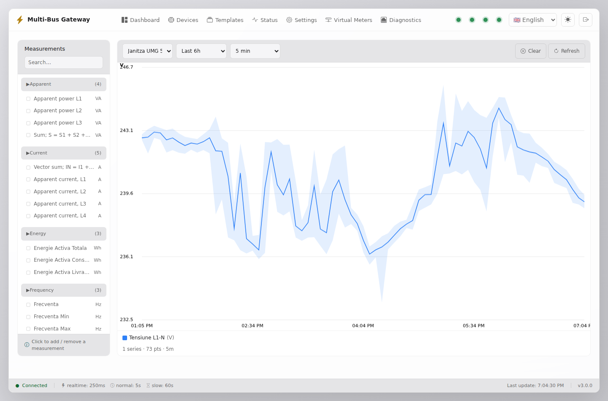

Grafice pe intervale din datele stocate în InfluxDB — alegi registrele de afișat
și fereastra de timp. Util pentru a vedea evoluția (tensiuni, putere) fără a
deschide Grafana. Comparațiile sunt pe aceeași unitate (axă comună corectă).

---

## 4. Dispozitive (Devices)

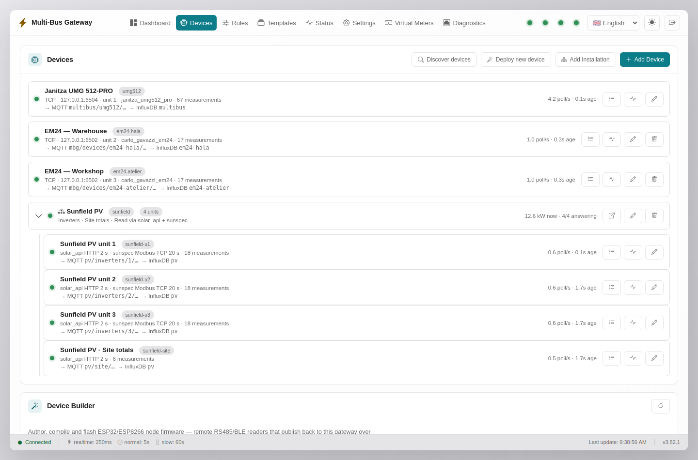

Toate sursele southbound (Tier 2), cu sănătatea live a fiecăreia. De aici
**adaugi un dispozitiv** (deschide wizard-ul — vezi §18), **editezi** conexiunea,
sau intri în **registrele** unui dispozitiv. Fiecare rând arată protocolul
(Modbus TCP/RTU, HTTP/JSON, MQTT), adresa, starea de conectare și numărul de
măsurători selectate. Dispozitivul primar apare primul.

Unitățile unei **plante** (un template + un endpoint + N unit id-uri) stau
grupate sub rândul plantei. Butonul de deschidere de pe acel rând duce la
**pagina plantei**: starea ei (`online` / `partial` / `offline`) și
recensământul unităților, grila de totaluri publicate pe `mbg/plants/<id>/…`,
tabelul unităților (sănătate, ultima citire, cadență, erori — cu redenumire și
intrare în fiecare unitate), comutatorul de totaluri și cardul de ieșiri.
Identitatea de rutare a plantei e fixată după creare; sink-urile per unitate se
declară o singură dată și se aplică întregii plante.

---

## 5. Template-uri (Templates)

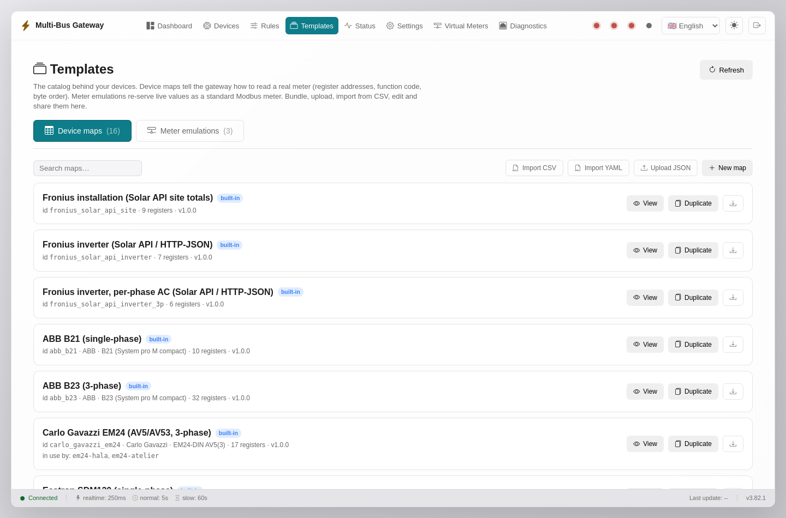

Catalogul de hărți de dispozitiv — profilele field-verified (Janitza, Eastron
SDM120/630, ABB, Schneider, Carlo Gavazzi EM24, presetări Zigbee/BLE/MQTT). Un
template descrie harta de registre + protocolul + categoriile. De aici
**încarci** un template nou (JSON/CSV), **exporți**, sau **creezi/editezi** unul.
Fiecare device se leagă de un template — de acolo își ia catalogul de registre.

---

## 6. Stare (Status)

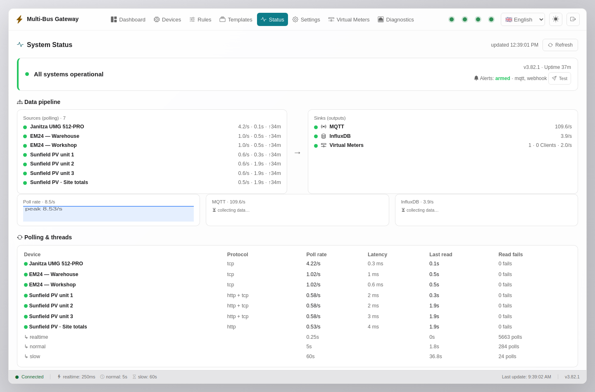

Sănătatea sistemului la un loc: per dispozitiv (rata de poll, latență, ultima
citire, **taxonomia erorilor** — timeout / excepție_N / conexiune), starea
sink-urilor (MQTT/InfluxDB conectate, rate, buffer store-and-forward), metere
virtuale, și **jurnalul de evenimente** recent. E prima pagină la care te uiți
când ceva nu merge — îți spune *care strat* e bolnav.

---

## 7. Metere virtuale (Virtual Meters)

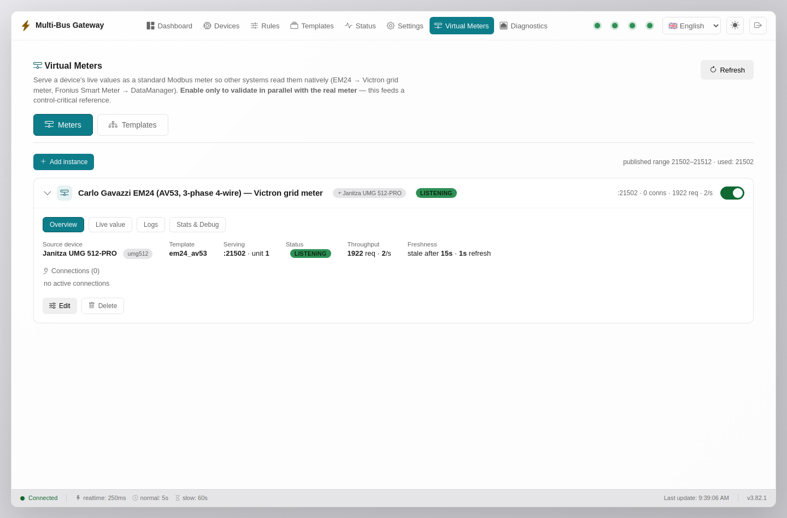

Emulările Modbus TCP servite mai departe (un consumator citește gateway-ul ca pe
un meter fizic). Fiecare instanță arată template-ul emulat (EM24, Fronius TS…),
portul, starea, rata de cereri și conexiunile active. De aici configurezi
**politica de staleness** (legacy / fail / sentinel / hold — absența nu e
niciodată servită ca 0) și **blocul de calitate in-band** (registrele 61440).
Subtab-urile arată preview-ul valorilor și statistici/debug de comunicație.

---

## 8. Diagnostics — Monitor magistrală

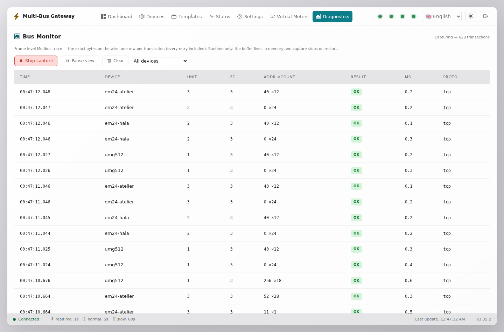

Trace Modbus **la nivel de frame** — octeții exacți de pe fir, un rând per
tranzacție (fiecare retry inclus). Pornești captura, filtrezi pe dispozitiv, și
vezi FC, adresa, rezultatul (OK / excepție / timeout / CRC), latența. Un click pe
rând deschide frame-urile brute segmentate (MBAP / PDU / CRC). Runtime only —
bufferul e în memorie, captura se oprește la restart. Instrumentul #1 la
comisionarea unui bus nou.

---

## 9. Diagnostics — Sondă registru (endianness)

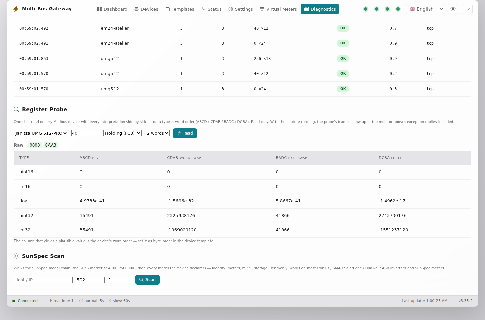

Citire one-shot pe **orice** dispozitiv Modbus, cu **toate interpretările una
lângă alta** — tip de date × ordine de cuvinte (ABCD / CDAB / BADC / DCBA).
Coloana care dă o valoare plauzibilă e ordinea corectă a dispozitivului — o
setezi ca `byte_order` în template. Rezolvă în secunde „ghicește word order-ul"
la un meter necunoscut. Afișează și hex-ul brut + ASCII.

---

## 10. Diagnostics — Scanare SunSpec

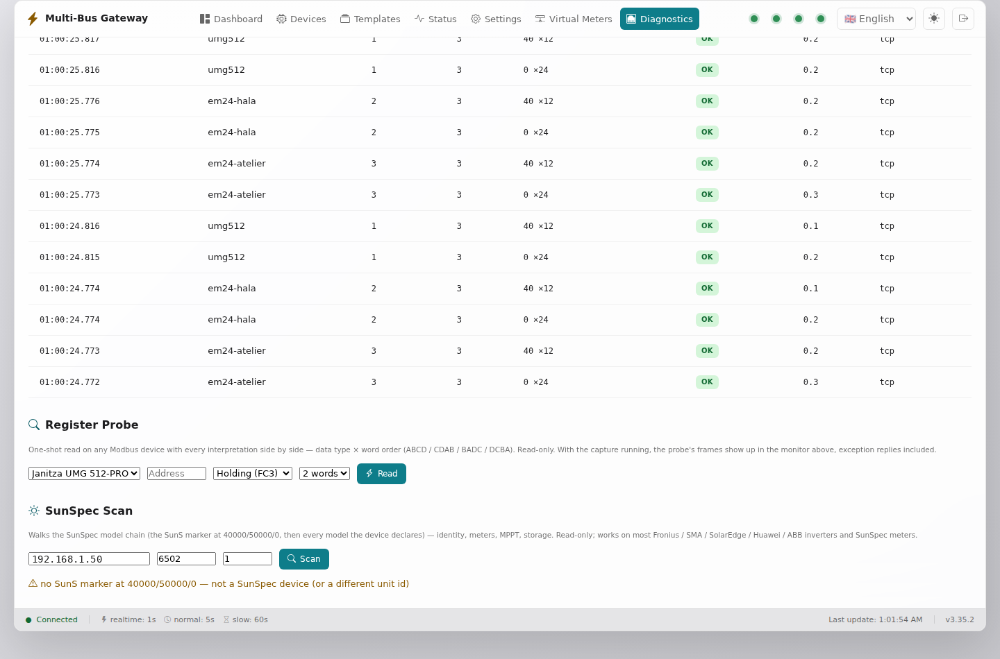

Parcurge lanțul de modele SunSpec al unui invertor/meter (markerul SunS, apoi
fiecare model declarat de dispozitiv) — identitate (producător, model, serie),
metere, MPPT, stocare. Doar citire; enumerează ce declară device-ul, nu
fabrichează nimic. Onboarding aproape automat pentru invertoarele Fronius / SMA /
SolarEdge / Huawei.

---

## 11. Settings — MQTT

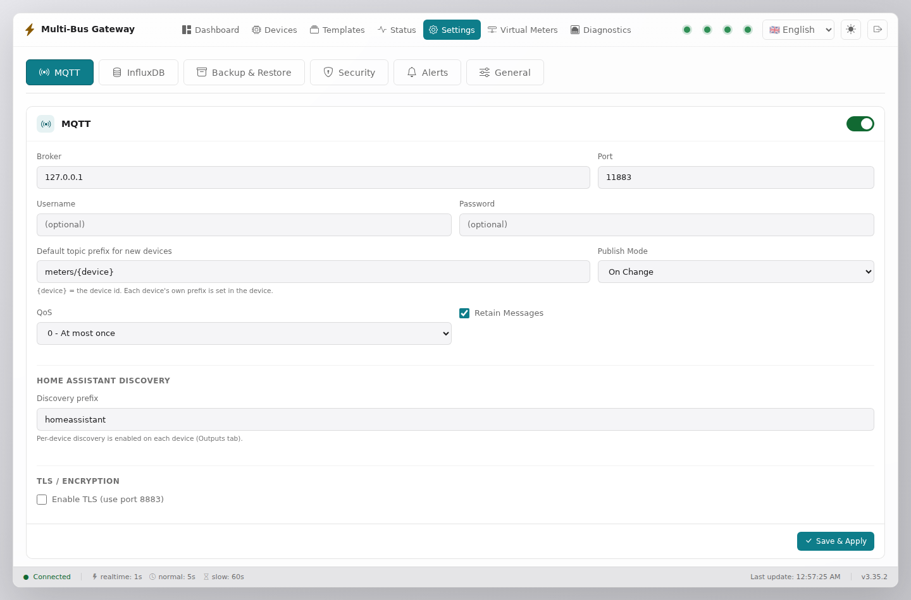

Conexiunea la broker (adresă, port, user/parolă, TLS), modul de publicare
(*changed* / *all*), retain/QoS, și **Home Assistant discovery**. Rutarea per
device (topicuri, prefixe) trăiește pe device, nu aici — aici e doar conexiunea
brokerului. Salvarea aplică live (reconectare).

---

## 12. Settings — InfluxDB

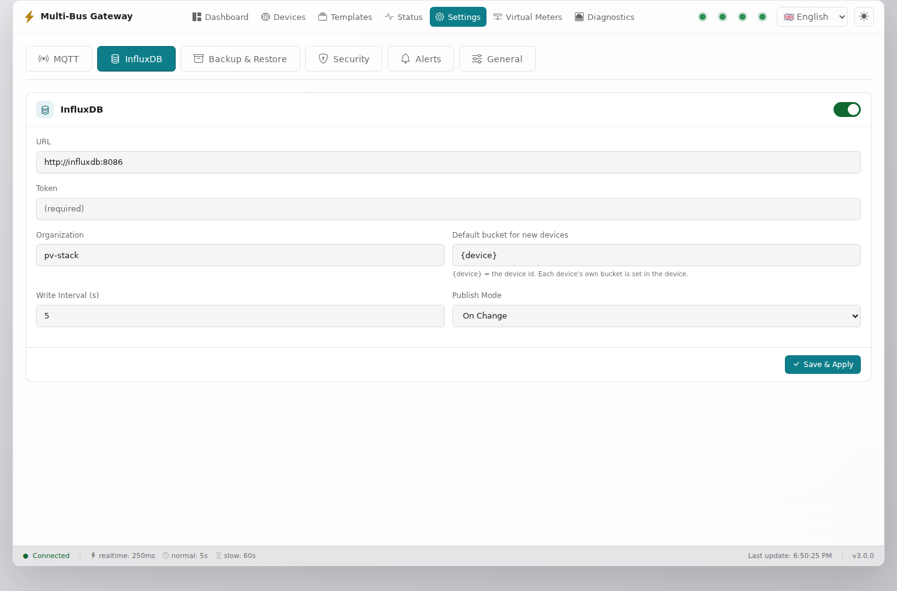

Conexiunea la InfluxDB (URL, token, org, bucket), intervalul de scriere și modul
de publicare. Include **buffer-ul store-and-forward**: dacă InfluxDB pică,
punctele se țin (în RAM + opțional pe disc) și se rejoacă cu timestamp-ul original
la reconectare — fără gap-uri false.

---

## 13. Settings — Backup & Restore + Snapshot-uri

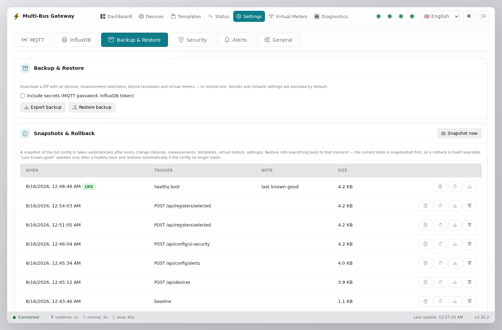

Sus: **export/import** al întregii configurații ca ZIP (secretele excluse
implicit). Dedesubt: **Snapshot-uri & Rollback** — un snapshot al configurației se
face automat după fiecare schimbare; poți face rollback la orice moment (starea
curentă se salvează întâi, deci e reversibil), vezi **diff-ul semantic** față de
prezent, descarci sau ștergi. „Last known good" se restaurează automat dacă
configurația nu se mai încarcă la boot.

---

## 14. Settings — Securitate

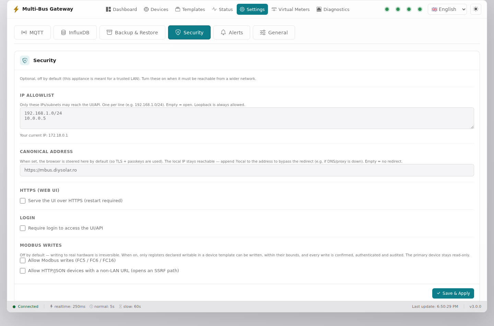

**IP allowlist**, **adresa canonică** (redirect spre `https://…` cu portița
`?local`), **HTTPS** pentru UI, **login + roluri** (admin / operator / viewer),
lockout, **passkeys (WebAuthn)** și scrierile Modbus (gate cu limite din template).
E panoul de la care pornești securitatea când cutia iese din LAN-ul de încredere.

---

## 15. Settings — Securitate: Jurnal de audit

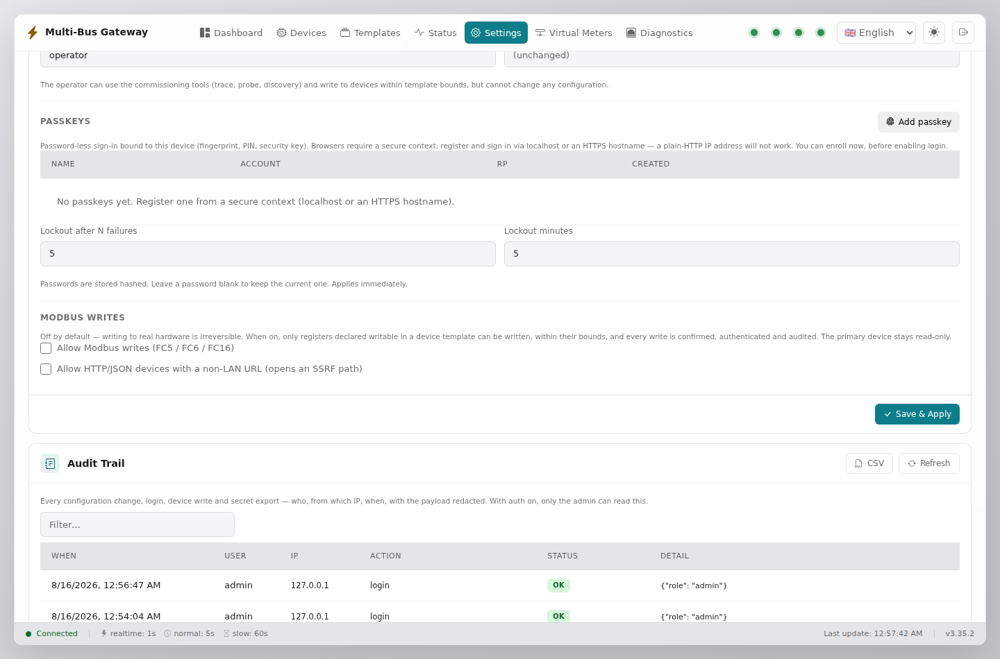

**Jurnalul de audit** (partea de jos a paginii de securitate): cine a schimbat
ce, când, de la ce IP — cu payload-ul redactat. Filtrabil, exportabil CSV.
Include login-uri (ok/greșit/lockout), scrieri pe dispozitive, exporturi de
secrete. Fiecare refuz (403) apare pe numele contului care l-a încercat.
**Doar rolul admin** poate citi conținutul: captura de aici e vederea unui
*operator*, unde tabelul afișează „The audit trail requires the admin role" —
adică exact gate-ul de rol în acțiune.

---

## 16. Settings — Alerte

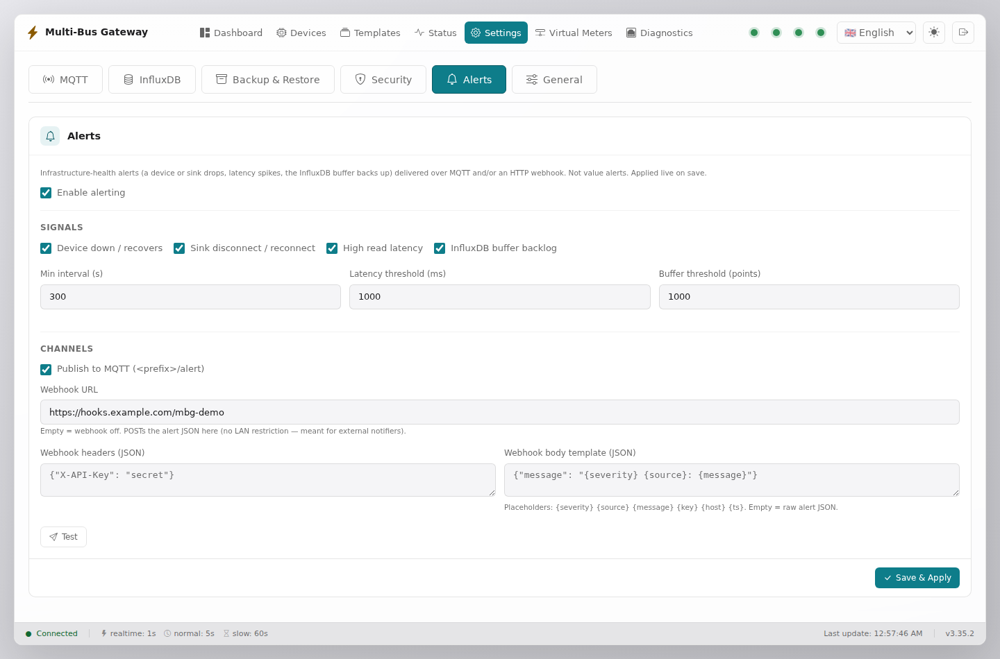

Reguli de alertă locale + webhook-uri: dispozitiv căzut/revenit, latență, buffer
InfluxDB. (Notificările „grele" — SMS/Telegram — trăiesc în serviciul de alerte
separat; aici sunt semnalele de bază ale gateway-ului.)

---

## 17. Settings — General

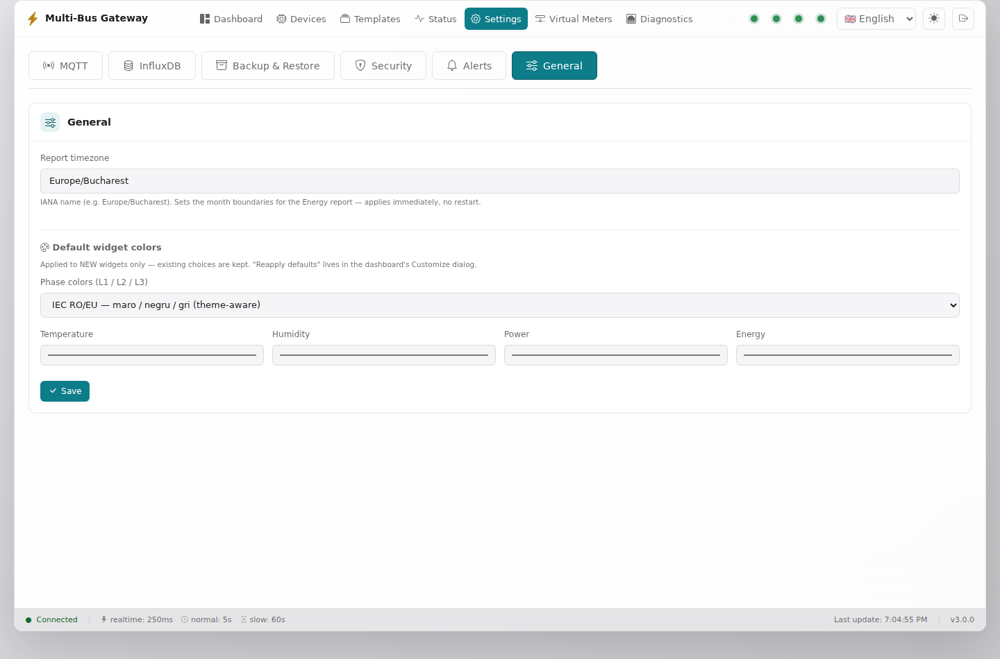

Parametri de sistem: fusul orar, culorile default de fază (convenție IEC / RST /
distinct), și alte setări globale de UI.

---

## 18. Wizard adăugare dispozitiv — pasul 1 (Conexiune)

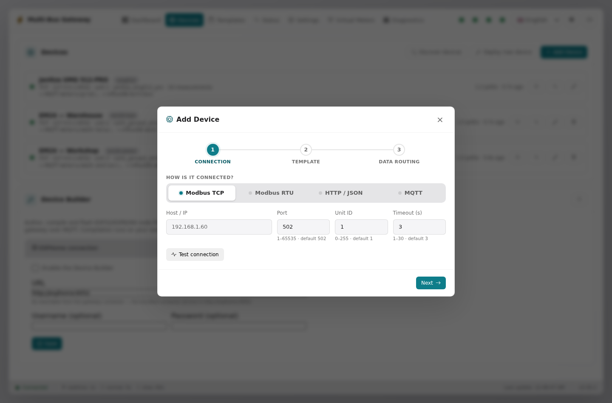

Fluxul ghidat de adăugare a unui dispozitiv, în 3 pași. **Pasul 1 — Conexiune**:
alegi protocolul (Modbus TCP / RTU / HTTP/JSON / MQTT) și completezi parametrii
(IP+port / port serial+baud / URL / broker+topic). Butonul **Test connection**
verifică live înainte de a salva; pentru MQTT ai și **Browse topics** (alegi
topicul din ce publică brokerul, nu-l tastezi orb). Pasul 2 alege template-ul
(harta de registre), pasul 3 configurează rutarea (MQTT/InfluxDB/vmeter).

---

## Note

- **Roluri**: un *viewer* vede toate paginile (read-only); un *operator* poate
  folosi uneltele de comisionare și scrie pe dispozitive, dar nu schimbă
  configurația; un *admin* poate tot, inclusiv audit-ul și securitatea.
- **Temă**: comutatorul soare/lună (dreapta-sus) schimbă clar/întunecat; UI-ul
  respectă și preferința sistemului.
- **Limbă**: EN + RO incluse; se adaugă altele copiind un fișier din
  `ui/languages/`.

*Capturi generate pe versiunea 3.35.2, pe o instanță demo efemeră
(simulatoare `loadtest/sim_devices.py` + broker/Influx de unică folosință,
Playwright la 1440×950, login demo). Când UI-ul se schimbă vizibil,
re-generează-le la fel — mediul demo se ridică în câteva minute și
capturile rămân publicabile (zero date de producție).*
