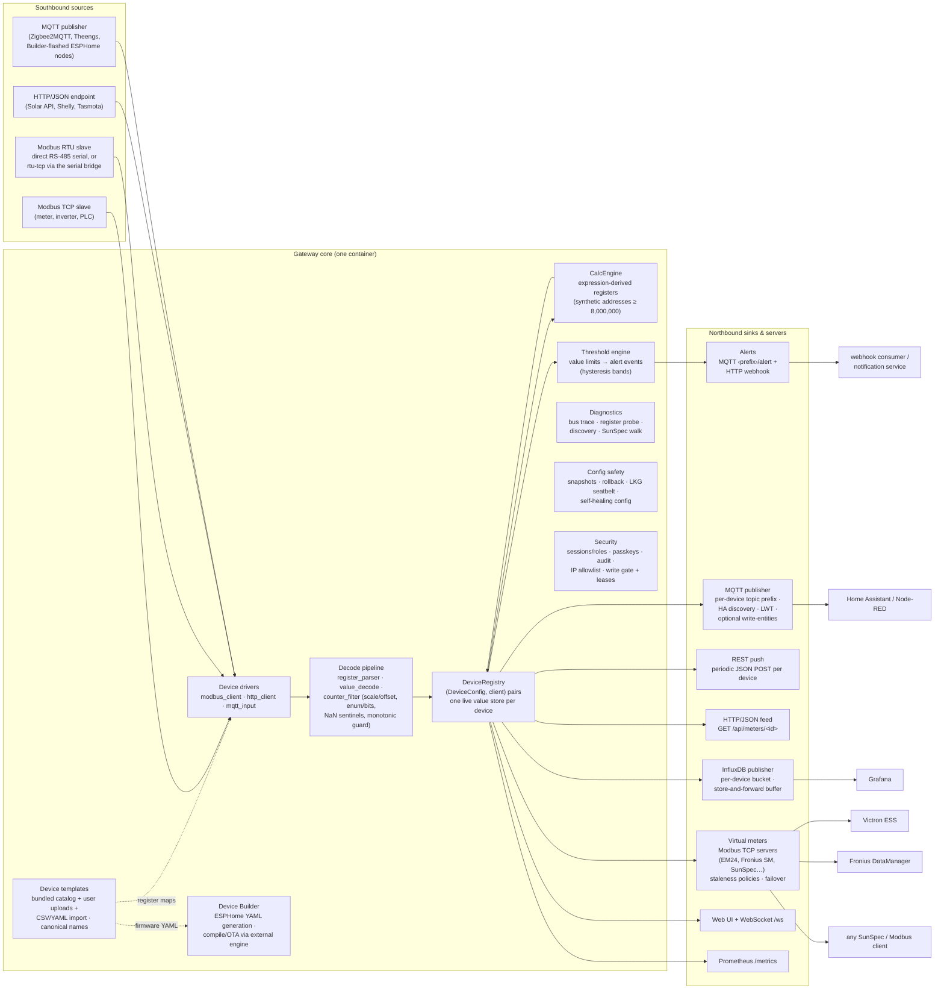
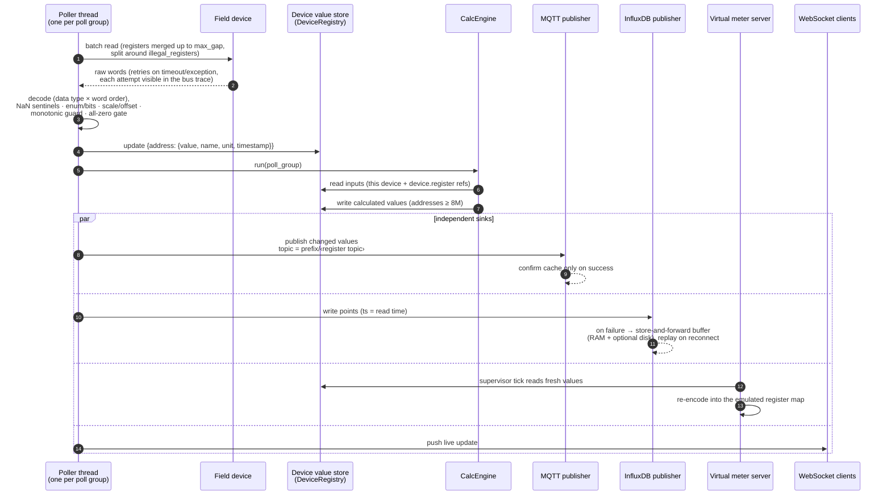
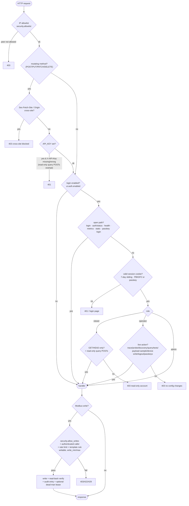

# Architecture — Multi-Bus Gateway

Multi-Bus Gateway is a **protocol gateway**: it acquires measurements from
southbound field devices (Modbus TCP, Modbus RTU — direct serial or over a
network serial bridge —, HTTP/JSON, MQTT), verifies and normalizes them, and
routes them to independent northbound sinks (MQTT, InfluxDB, REST push,
HTTP/JSON feeds) and to **virtual Modbus meters** that re-serve the data to
downstream consumers. It can also *author* its own southbound endpoints: the
**Device Builder** generates, compiles and flashes ESPHome firmware for remote
ESP32/ESP8266 Modbus-reader nodes that publish back over MQTT. It is *not* an
energy-reporting or billing application — cost, tariff and analytics are the
job of whatever sits downstream.

All facts below are drawn from the code in `multibus/` (Python package),
`serial-bridge/` (companion container) and `ui/` (vanilla-JS SPA). File
references use `module.py` names.

## 1. System overview

Key properties:

- **Pipelines are independent.** Polling never depends on a sink; MQTT,
  InfluxDB and the virtual meters each reconnect on their own. A dead broker
  does not stop acquisition; a dead meter does not stop the UI.
- **The device id is the routing key.** Each device carries its own MQTT
  topic prefix, InfluxDB bucket + device tag, and output toggles
  (`DeviceConfig` in `config.py`).
- **Uniform naming.** A register's `name` is drawn from a canonical
  dictionary (`canonical_fields.py`, 56 fields — see
  [`canonical-fields.md`](canonical-fields.md)), so the same physical
  quantity is named the same on every device: `voltage_l1_n` everywhere,
  hierarchical MQTT topic (`voltage/l1_n`), flat InfluxDB field. This is
  also what makes device-level failover possible (§6).
- **Invisible migration.** Device #1 (the primary) is synthesized from the
  legacy flat `modbus:`/`mqtt:`/`influxdb:` sections of `config.yaml`, so an
  install upgraded from the single-meter era keeps byte-identical topics,
  buckets, tags and Home Assistant identifiers.

## 2. Subsystem map

One paragraph per module group; every file lives in `multibus/` unless noted.

- **Acquisition** — `modbus_client.py`, `http_client.py`, `mqtt_input.py`
  poll or subscribe southbound; `device_registry.py` owns the live value
  stores; `config.py` owns `DeviceConfig` and the config bundle on disk.
- **Decode** — `register_parser.py` (data types × word orders),
  `value_decode.py` (`apply_corrections` — the ONE wire→value pipeline
  shared by Modbus/HTTP/MQTT: nan sentinels → enum/bits → scale/offset →
  monotonic hook), `counter_filter.py` (the monotonic
  guard for cumulative counters), `encoder.py` (the reverse direction:
  values → register words for virtual meters and writes, including SunSpec
  not-available sentinels).
- **Derived values** — `calc_engine.py` + `expressions.py` (whitelisted-AST
  formula evaluation, per poll group).
- **Templates & naming** — `device_template.py` and the bundled catalog in
  `device_templates/`; `csv_import.py` and `yaml_import.py` turn vendor/
  community register maps into template previews; `canonical_fields.py` is
  the single source of truth for register naming and drives the
  auto-canonicalize classifier.
- **Sinks** — `mqtt_publisher.py` (HA discovery, LWT, availability,
  optional write-entities), `influxdb_publisher.py` (store-and-forward
  buffer), `rest_push.py`; `backfill.py` is the offline gap-backfill tool.
- **Virtual meters** — `virtual_meter.py` (one emulated Modbus TCP server:
  datastore, staleness policies, quality block) and
  `virtual_meter_manager.py` (instances from `virtual_meters.yaml`,
  supervisor, failover routing, `device_fallback`, retained state topic).
- **Alerting** — `alerts.py` (AlertManager: signal gating, rate limiting,
  MQTT + webhook delivery), `threshold_engine.py` (value-threshold
  hysteresis bands), `event_log.py` (persisted event ring).
- **Device Builder** — `esphome_generator.py` (device template → ESPHome
  node YAML), `esphome_client.py` (HTTP/WS client for the external ESPHome
  build engine), `routes/builder_routes.py` (node management, compile/OTA
  consoles, adopt flow, web flasher).
- **Security** — `auth.py` (sessions, roles, lockout), `passkeys.py`
  (WebAuthn), `audit.py` (append-only JSONL), `redact.py` (secret masking),
  `write_lease.py` (crash-safe dead-man write leases).
- **Config safety** — `snapshots.py` (snapshots, semantic diff, rollback,
  LKG), `tombstone_store.py` (device soft-delete/restore).
- **Diagnostics** — `bus_trace.py` (frame-level TX/RX), `discovery.py`
  (Modbus + ESPHome-node LAN sweeps, SunSpec walk).
- **API & UI** — `api.py` (`create_api`) plus the extracted `routes/`
  modules (auth, builder, calculated, commissioning, config, templates,
  diagnostics, discovery, energy, metrics, registers, status, system,
  values, vmeters); the SPA lives in `ui/`.
- **Serial bridge** — `serial-bridge/supervisor.py` (separate container):
  ser2net managed by a Python supervisor, exposing USB serial adapters as
  stable TCP endpoints (§3).

## 3. Core components

### DeviceRegistry (`device_registry.py`)

Owns the `(DeviceConfig, client)` pairs and **one live value store per
device** (`values: {device_id → store}`). A store is a dict keyed by register
**address**; each entry carries `{name, value, label, unit, poll_group, timestamp,
ts, mono, interval}` (`mono` = the monotonic stamp and `interval` = the
producing poll cadence — the virtual-meter freshness inputs; plus
`calculated: True` for derived values). The primary
device's store *is* the legacy `current_values` dict — same object, aliased —
which is what keeps the migration invisible. Mutations (add/replace/remove/
resync) are lock-protected; reads are lock-free snapshots.

### Device drivers

| Driver | Protocol | Model | Notes |
|---|---|---|---|
| `modbus_client.py` | Modbus TCP, RTU (direct serial), **rtu-tcp** (RTU frames over a TCP socket to the serial bridge) | one poller thread per poll group | batch reads with configurable `max_gap` merging that never bridges a declared `illegal_registers` address; retry with error taxonomy (`timeout` / `exception_N` / `connection`); per-device staleness bound `stale_after_s`; optional `drop_all_zero` data-readiness gate (a sleepy device's all-zero frame is dropped, the cache keeps last-good); wedged-link forced reopen after 5 consecutive failed polls (a serial/PTY link can stay "open" while dead — TCP self-heals, RTU needs the belt-and-braces); optional `polling.startup_jitter_s` desynchronizes poll groups at boot |
| `http_client.py` | HTTP/JSON | one poller thread per poll group | per-register `json_path` (dot/bracket paths, list indices); SSRF guard: URL must resolve to private LAN addresses only (pinned literal IP, redirects refused) unless `security.allow_nonlan_http_devices`; a fetch that overruns its interval backs off instead of tight-looping |
| `mqtt_input.py` | MQTT subscribe | push-driven (no poll rate) | per-register `topic` with `+`/`#` wildcards or the device base topic; value from `json_path` or the bare payload; the natural transport for Builder-flashed ESPHome nodes |

All three produce the same normalized batch shape, so every sink works with
every source. **One Modbus connection per device**, shared across its poll
groups; the per-device lock is released during retry backoff so a slow group
cannot stall the realtime group.

### The decode pipeline

Everything between raw words and a published value is centralized:

- **Data types** — `int16/uint16/int32/uint32/int64/uint64/float/double/
  string` plus signed-magnitude `sm16`/`sm32` (top bit = sign), across the
  four word orders (`abcd`, `cdab`, `badc`, `dcba`) — decoded in
  `register_parser.py`, encoded back in `encoder.py` (including SunSpec
  "not available" sentinel words).
- **Scale and offset** — engineering value is `raw / scale + offset`, so a
  zero-point or unit shift (Kelvin×10 → °C) decodes correctly.
- **Enum / bitfield decode** (`value_decode.py`) — a status register may
  declare `enum` (`{code: label}`, optional `mask`+`shift` to extract a
  packed sub-field first) or `bits` (`{bit: name}` joined for each set
  bit). The value becomes a **string** and flows to every sink like the
  existing string registers; an unmapped code reads `"unknown (n)"`, never
  a silent wrong label. HA typing recognizes the register as a text sensor.
- **Not-available sentinels** — a register may declare `nan` (True = the
  type's SunSpec not-implemented value such as `0x8000`/`0xFFFF`, or an
  explicit raw value / list); a match reads as *missing* rather than a
  garbage number (−32768 °C). Float NaN/Inf are always dropped.
- **Monotonic-counter guard** (`counter_filter.py`) — a cumulative energy
  register flagged `monotonic: true` drops a transient downward read (which
  every downstream `difference()` would misread as a counter reset injecting
  a phantom delta) while accepting a genuine, sustained reset.

### Device templates (`device_template.py`, `multibus/device_templates/`)

A template is a portable JSON file describing an equipment type: registers
(address, name, label, unit, data type, scale/offset, enum/bits maps,
`monotonic`/`nan` flags, category, poll group, visual thresholds,
`json_path`/`topic` for non-Modbus transports), explicit Home Assistant
typing (`device_class`, `state_class`, `entity_category`, …), suggested
defaults, and — for writable registers — the **write safety envelope**
(`writable`, `write_min`, `write_max`, `write_safe`). Eleven templates are
bundled (Janitza UMG 512-PRO with 4,126 registers, ABB B21/B23, Carlo
Gavazzi EM24, Eastron SDM120/SDM630, Schneider iEM3000, Fronius Smart Meter
65A, plus three MQTT-transport maps: Zigbee2MQTT sensor, Theengs BLE,
generic MQTT-JSON); provenance for each is documented in
[`device-catalog.md`](device-catalog.md). User templates round-trip through
upload/export and can be generated from a vendor CSV
([`csv-import.md`](csv-import.md)) or a community YAML register map
(`yaml_import.py` — accepts bare lists, `registers:` lists or MBG-native
wrappers, with per-field aliases); both importers return a reviewed preview,
never a blind save.

Templates opt into **canonical naming** (`"canonical": true`); the bundled
vendor maps are canonical, non-canonical or duplicate names surface as load
warnings, and a one-click **auto-canonicalize** infers canonical names for a
cryptic map via a conservative server-side classifier that returns nothing
when unsure.

### CalcEngine (`calc_engine.py`, `expressions.py`)

Calculated registers are formula-derived measurements evaluated per poll
group, next to the real registers:

- Each calculated register gets a **synthetic address** `8,000,000 + i`,
  above any real Modbus address, in the *same* per-device store — so it
  flows to MQTT, InfluxDB, virtual meters, Monitor and History like any
  measurement.
- Expressions are validated and evaluated through a **whitelisted AST
  walker** (never `eval()`): arithmetic, comparisons, ternary, functions
  `min/max/avg/abs/round/sqrt/pow/floor/ceil/clamp`, constants `pi/e`,
  cross-device references (`device.register`), and the stateful helpers
  `prev(x)` (previous value) and `dt` (seconds since last evaluation) —
  enabling e.g. `(E - prev(E)) / dt * 3600` for power from an energy
  counter. Guards: 500-char limit, arity checks, bounded `**` exponent,
  division-by-zero → skip, a missing input skips the round (no partial
  publishes), and an engine error can never kill a poller.

### Plants and the PlantAggregator (`plant_aggregator.py`)

A `plants:` entry is one template + one endpoint + N unit ids, expanded by
`Config._expand_plants()` into N ordinary devices (own socket each, managed
through the plant). On top of the units, `PlantAggregator` — a daemon
thread started with the app — combines each plant's live stores every 10 s
by canonical-name rule (sum for powers/currents/energies, average for
voltages/frequency/PF/temperatures, skip for identity/status words) and
publishes the result as a first-class entity: `mbg/plants/<id>/<canonical
topic>` on MQTT (plus `units_online`, `units_total`, `status`) and the same
canonical measurements in InfluxDB tagged `device=<plant id>,
aggregate=plant`. `compute_plant_aggregates()` is pure and shared with
`GET /api/plants`. The namespace convention is deliberate: device values
live under `mbg/devices/<id>/…`, plant values under `mbg/plants/<id>/…`,
so a consumer always knows which entity published a topic. The roadmap
for making the aggregate counter-safe and giving plants a full UI is in
[fronius-migration-plan.md](fronius-migration-plan.md).

### Value flow conventions

- **Timestamps** are the *read* time, not the publish/flush time.
- **Publish modes** per sink: `changed` (default; cache confirmed only after
  a successful publish, so nothing is lost to a failed send) or `all`. An
  optional `mqtt.heartbeat_interval` republishes a steady value after N
  seconds so Home Assistant does not grey the entity out.
- **Absence is never encoded as a measurement** — a missing value is skipped
  on MQTT/InfluxDB, reported as `stale` on the JSON feed, and handled by an
  explicit staleness policy on virtual meters (§6).

## 4. RTU over the network: the serial bridge

RTU has two modes (both live-validated; details in
[`rtu-serial.md`](rtu-serial.md)):

- **Direct serial** — the classic `/dev/ttyUSB*` bind into the gateway
  container (`protocol: rtu`), for static single-host setups.
- **Over network** — the **`serial-bridge`** companion container
  (`serial-bridge/supervisor.py`: ser2net driven by a Python supervisor)
  exposes each USB serial adapter as a **stable internal TCP endpoint**,
  and the gateway's `rtu-tcp` transport tunnels RTU frames over that socket
  (`ModbusTcpClient` + RTU framing). The gateway container stays
  unprivileged — no `/dev` mapping on the primary path.

Bridge properties: ports are keyed by USB serial number (FTDI/CP210x) or,
for serial-less adapters (cheap CH340), by physical USB port-path, persisted
across replug/restart — *same adapter, same port, for life*. Hotplug is
handled by kernel uevents plus a periodic reconcile; each adapter is held
exclusive (TIOCEXCL), single TCP client, data ports internal-only, control
API (`GET /adapters`, consumed by the gateway's adapter scan) on localhost.
A `BRIDGE_EXCLUDE` list guarantees an adapter owned by another service is
never opened. The supervisor also survives unclean shutdowns: stale UUCP
lockfiles are cleared before (re)starting ser2net, and a dead ser2net is
respawned.

## 5. A poll → publish cycle

Failure behavior along this path:

- A failed read increments the per-kind error counters
  (`timeout` / `exception_N` / `connection`) surfaced on `/api/status`,
  `/metrics` and the Status page; the value store simply keeps its last
  entry with its old timestamp — consumers judge freshness by age. A device
  going unreachable logs **one** WARN and emits one `unreachable` event
  (recovery: one INFO + `recovered`) — edge-triggered, not per-poll noise.
- A failed MQTT publish leaves the change cache unconfirmed, so the value
  republishes after reconnect; on every reconnect the cache is cleared and
  full state republished (retained messages may have been lost).
- A failed InfluxDB write lands in the **store-and-forward buffer**
  (default 10 min / 50,000 points, persisted to
  `config/influx_buffer.jsonl` when `buffer_persist: true`) and is replayed
  with original timestamps — idempotent, since InfluxDB dedupes on
  measurement+tags+timestamp. MQTT is deliberately *not* replayed: it is a
  live bus; the current state is republished instead.

## 6. Virtual meters and the staleness convention

A virtual meter instance is an isolated Modbus TCP server (own thread, own
asyncio loop) that re-serves live values under another meter's register map
(templates: Carlo Gavazzi EM24, Fronius Smart Meter TS, SunSpec 213 float,
or any user-defined map). The datastore spans **only** the emulated map —
reads outside it get *illegal data address*, exactly like the real meter
being emulated. Composite templates may source rows from **several devices**
(`device.register`) and sum rows (`sum:`) — a sum takes the quality of its
worst member, never a partial total.

Every row resolves through a per-register staleness decision:

```mermaid
stateDiagram-v2
    direction LR
    [*] --> Fresh : value newer than its bound<br/>(row stale_after_s → max(derived poll-cadence<br/>bound, instance bound) → instance bound)

    Fresh --> Stale : age exceeds bound
    Stale --> Fresh : new value arrives

    state "Policy applied to a stale/missing row" as P {
        state "legacy (default)" as L
        state "fail" as F
        state "sentinel" as S
        state "hold" as H
        L : row keeps last words —<br/>freshness judged once per instance ·<br/>all-stale then server stops responding
        F : any read touching the row gives<br/>a Modbus exception (no partial truth)
        S : row served as SunSpec N/A —<br/>float→NaN, int16→0x8000, uint16→0xFFFF…
        H : last value held up to max_hold_s,<br/>then behaves like fail
    }

    Stale --> P
    P --> [*] : server stays up while ≥1 source is fresh<br/>(policy modes) · all dead then socket closes so the<br/>consumer's own meter-loss fail-safe engages
```

The rationale is a single rule: **absence is not encodable as a
measurement**. A frozen or zeroed value can mislead a control loop (ESS,
export limiter), so a stale row either refuses the read (`fail`), declares
itself not-available in the consumer's own vocabulary (`sentinel`), or is
held for a bounded, declared time (`hold`). `legacy` preserves the exact
pre-composite behavior for existing single-source meters. A source value
that cannot be encoded on a numeric row (a text enum/bits value) degrades
that **row** to missing — it never aborts the whole block rebuild.

**Freshness bounds are derived, not hand-tuned.** Drivers stamp each value
with its poll-group interval, and a row's default bound is 2.5× that cadence (capped at 300 s — a genuinely slower source sets an explicit, uncapped row `stale_after_s`)
(one missed poll plus jitter); calculated registers inherit the slowest
input's interval. The cascade is loosening-only against the instance floor —
a realtime row's sub-second cadence bound never *tightens* below the
instance bound, so a single hiccup cannot flap the meter — while an explicit
row `stale_after_s` wins outright (may tighten or relax).

### Redundant sources and failover

Two layers of redundancy, both driving the same resolver:

- **Per-register failover** — a row may be backed by an ordered list of
  sources instead of one: `source: {failover: ["a", "other.b"]}`. Each
  rebuild serves the highest-priority candidate that is *fresh*; a
  missing/stale candidate is skipped in order, and the primary is preferred
  whenever fresh, so recovery switches back automatically. If **no**
  candidate is fresh the row degrades through `on_stale` exactly like a
  single stale source — never a silently-stale value into an ESS.
- **Instance-level `device_fallback`** — one field on the instance names a
  secondary "twin" source device; at start every bare-name `live` row is
  rewritten into a failover pair `[name, <fallback>.name]` (possible
  because canonical field names are identical across devices). Const, sum,
  already-failover and explicit `device.register` rows are left untouched.
  The fallback is validated at save and re-checked at start — a mis-set
  value is ignored with a warning, never blocks a control-critical meter
  from starting.

Every serving-source switch logs an event (`warn` on drop to a
lower-priority source, `info` on recovery) naming the meter, register and
both sources.

Consumers that want the quality **in-band** (PLC/SCADA on the same Modbus
connection) can enable the read-only **quality block at 61440**
(convention v1): format version, block state (0 legacy / 1 ok / 2 degraded /
3 stale), fresh/stale/missing row counts, total rows, and the age of the
newest fresh value as u32 seconds. Wire spec:
[`virtual-meter-spec.md`](virtual-meter-spec.md).

The same data is available as JSON at `/api/virtual-meters/<id>/values`
using the aggregator convention: `value: null` when not good, plus
`quality: good|stale|missing`, `age_s`, and `last_value` kept separate.

Observability per instance: a 1024-entry query log (time, FC, address,
count, OK/exception, latency, response), counters, request-rate history,
most-read registers, active client connections, and lifecycle events —
plus retained MQTT state (`vmeter/<id>/state`) carrying the staleness
policy and its bounds (`on_stale`, `stale_after_s`, `max_hold_s`), the last
rebuild's quality counts, and the live failover routing (per register:
candidates, active source, on-primary flag), and HA discovery for the
meter's diagnostics — a monitor can see *how* a meter degrades and which
redundant source is feeding it, not just that it went stale.

## 7. Threshold engine → alerts

`threshold_engine.py` turns each register's **visual** thresholds — the same
`warningLow/dangerLow/warningHigh/dangerHigh` limits that colour the
dashboard — into alert **events**, delivered over the existing alert path
(MQTT `<prefix>/alert`, HTTP webhook, event log — see
[`alerts-webhooks.md`](alerts-webhooks.md)). Off by default
(`alerts.signals.threshold`).

- **Hysteresis state machine** — *fast to alarm, slow to clear*: escalation
  fires on the raw limit (safety), while clearing to normal requires the
  value to retreat past the boundary by `threshold_deadband_pct` (default
  2 %), so a value hovering at a limit cannot flap. One band per value —
  a higher severity inherently suppresses the lower one; events fire only
  on band **transitions**, never on steady state.
- **Off the hot path** — the engine is pure (no I/O, no clock) and runs in
  the existing 5 s event harvester over each device's live value store; the
  poll loop is untouched. A crossing calls the same rate-limited
  `AlertManager.fire()` as the infrastructure signals
  (device/sink/latency/buffer) — no new channels.
- **No phantom alarms** — a register the device has stopped refreshing
  (down/frozen) is not evaluated; the band holds and resumes cleanly on
  reconnect. Band state is pruned when a register or device goes away, so
  a removed limit cannot leave a stuck alarm.

## 8. Device Builder (ESPHome)

The Builder turns the gateway into a firmware authoring point for remote
ESP32/ESP8266 nodes — RS485/Modbus readers at other locations that publish
back over MQTT. The gateway does **not** compile firmware itself: an
external, stock **ESPHome** container does, driven entirely over its HTTP/WS
API (`esphome_client.py` — no shared volume, no new Python dependencies).
Off by default; one URL in Devices → Device Builder enables it, and
everything degrades gracefully without it.

- **Generate from template** (`esphome_generator.py`) — the differentiator:
  pick any Modbus device template + register subset and get firmware YAML
  (`uart`/`modbus`/`modbus_controller` with correct value types, byte
  order, scale folded into filters, poll groups → `update_interval` /
  `skip_updates`) publishing scalars to explicit per-register topics.
- **One-click Adopt** — the same wizard creates the *paired* gateway side:
  a user device-template and an MQTT-input device with byte-identical
  topics, so data flows in with zero double configuration.
- **Node management** (`routes/builder_routes.py`) — list (including
  mDNS-discovered adoptables and a native-API LAN sweep on port 6053),
  YAML import/editor with server-side validation, live-log console for
  compile / OTA flash / device logs (WebSocket relay), artifact downloads,
  fleet "update all".
- **USB web flasher** — first-time flashing from the browser via locally
  vendored esp-web-tools (no CDN), with Improv Wi-Fi provisioning over the
  same cable; **hardware profiles** (`config/builder_profiles.json`) are
  shareable board/pin presets for the wizard.
- **Security** — YAML content and command streams are admin-only under
  auth; every state change and stream lands in the audit log; secrets are
  redacted everywhere (the secrets.yaml helper only appends missing keys
  and never logs values).

## 9. Security model

Everything is **off by default** (trusted-LAN appliance) and opt-in per
layer — except **login**, which a fresh install turns ON with a generated
admin password printed once at first boot (`main.py`
`_first_run_provision`). The other layers: IP allowlist → API key →
write gate. All layers apply independently. (Reporting and hardening guidance: [`SECURITY.md`](../SECURITY.md).)

Highlights (details in the manual):

- **Roles**: `admin` (everything, including the Device Builder), `operator`
  (live commissioning actions, including bounded Modbus writes, but nothing
  that lands in a config file), `viewer` (read-only). Anti-enumeration
  decoy hashing and per-IP lockout on login; sessions persist across
  restarts as SHA-256 token hashes (`config/sessions.json`, 0600).
- **Passkeys (WebAuthn)**: per-user credentials in `config/passkeys.json`;
  require a secure context (localhost, or a hostname over HTTPS — an IP
  address is rejected as RP ID); passkey login shares the password lockout.
- **CSRF / SSRF**: mutating requests are refused when `Sec-Fetch-Site` /
  `Origin` indicate cross-site; HTTP-device URLs must resolve to private
  LAN addresses (pinned literal IP, redirects refused) unless explicitly
  allowed.
- **Reverse proxy**: `ui.trusted_proxies` feeds uvicorn's
  `forwarded_allow_ips` — X-Forwarded-* are honored only from listed proxies
  so the allowlist, lockout buckets and audit see real client IPs.
- **Write gate**: writes are OFF by default (`security.allow_writes`), the
  primary device is always read-only, encoding/bounds come from the template
  (never the caller), and a `lease_ms` write arms a **crash-safe dead-man
  lease**: the lease set is persisted to `config/write_leases.json`, so
  after a gateway crash the register is reverted to its declared
  `write_safe` value on the next boot. Home Assistant **write-entities**
  (`number`/`select` for writable registers) are double-gated
  (`mqtt.allow_write_entities` *and* `security.allow_writes`) and every
  broker command is re-validated server-side — template allowlist, bounds,
  rate limit, audit — because the broker is not a trusted caller.
- **Audit trail** (`audit.py`): append-only JSONL
  (`config/audit.jsonl`, 1 MB × 5 files rotation) of who did what — logins,
  writes, exports, restores, Builder actions — with secrets redacted from
  detail payloads (`redact.py`, applied uniformly to audit, snapshot diffs
  and API responses).

## 10. Config safety

`config.yaml` + per-device register files + templates + `virtual_meters.yaml`
form the **config bundle**. Four mechanisms protect it:

1. **Automatic snapshots** — every successful config-bearing mutation
   schedules a snapshot (2 s debounce; bursts coalesce), retained 50 deep,
   plus manual snapshots with a note. Each is a full-fidelity ZIP.
2. **Semantic diff & rollback** — snapshots diff key-by-key (YAML/JSON
   aware, secrets masked), and restore replaces the bundle verbatim after
   taking a `pre-restore` snapshot, so a rollback is itself reversible.
3. **Self-healing config** — the same `.good`/`.bad` contract also covers
   the per-device `selected_registers.json` files; a good load keeps a `config.yaml.good`
   snapshot; a later corrupt edit falls back to that last-known-good config
   (not bare defaults), so the primary keeps polling the right host through
   a bad edit. The broken file is preserved as `.yaml.bad`, saves stay
   disabled until it is fixed, and the condition is surfaced in
   `/api/status` (`config.healthy`) and raised as an alert.
4. **Last-known-good boot seatbelt** — after ~5 minutes of healthy uptime
   (with at least one successful device read) the bundle is marked LKG. At
   boot, a config that fails to parse is automatically restored from LKG and
   the load retried once — an unattended box survives a bad edit or a torn
   write.

Backups for *portability* are separate from snapshots: the export ZIP strips
secrets and host identity by default, and import merges over the live file
so stripped secrets survive the round-trip.

## 11. Observability

| Surface | What it carries |
|---|---|
| `/api/status` + Status page | per-device health, poll rates, error taxonomy (`timeout`/`exception_N`/`connection`), staleness, latency, forced reopens, sink stats, buffer counters, config health |
| `/metrics` (Prometheus) | `gateway_device_*`, `gateway_mqtt_*`, `gateway_influx_*`, `gateway_vmeter_*` (incl. per-state quality gauges) |
| `/health` | container probe; HTTP 503 only for a genuinely down virtual meter — an unreachable upstream degrades the body but never restart-loops the container |
| Event log (`config/events.jsonl`) | persisted ring of reachability edges, sink transitions, vmeter lifecycle + failover switches, rollbacks, alerts |
| Alerts (`alerts:` block) | infrastructure-health signals (device/sink/latency/buffer) **and** value-threshold crossings (§7), plus three ungated conditions (config-load failure, config-downgrade stamp, InfluxDB write-auth rejection) to MQTT `<prefix>/alert` and/or an HTTP webhook — see [`alerts-webhooks.md`](alerts-webhooks.md) |
| Home Assistant | per-device retained `…/availability` + `connectivity` binary_sensor, vmeter diagnostics via discovery |
| Bus trace + register probe | frame-level TX/RX hex with per-retry entries; one-shot reads decoded as every type × word order |

## 12. Process model

One primary container, one Python process (`main.py`), plus the bundled
stack (mosquitto, mqtt-explorer, influxdb, grafana, esphome — all default
services of the compose file) and one profile-gated companion
(`serial-bridge`, under `rtu-bridge`):

- FastAPI/uvicorn serves the UI, REST API and WebSocket
  (default `127.0.0.1:8080` on bare metal — the container image sets `UI_HOST=0.0.0.0` — optional TLS).
- Poller threads per device × poll group; push-driven MQTT-input clients.
- One thread + asyncio loop per virtual meter instance; a supervisor thread
  ticks freshness and restarts wedged listeners.
- Background threads: MQTT/InfluxDB reconnect monitors, REST pushers, the
  5 s event harvester (health edges + threshold engine), write-lease
  sweeper, snapshot debouncer, LKG marker.
- Hot-reload by design: device/register/poll/sink changes apply without a
  container restart; only UI TLS changes and (recommended) newly imported
  devices need one.

Companion containers, both optional and independently restartable:

- **`serial-bridge`** — ser2net + supervisor exposing USB serial adapters
  as stable TCP endpoints for `rtu-tcp` devices (§4). The gateway degrades
  gracefully when it is absent (adapter scan reports the bridge down;
  direct-serial mode is unaffected).
- **`esphome`** — the stock ESPHome build engine behind the Device Builder
  (§8); dashboard port unpublished — the gateway proxies everything.
