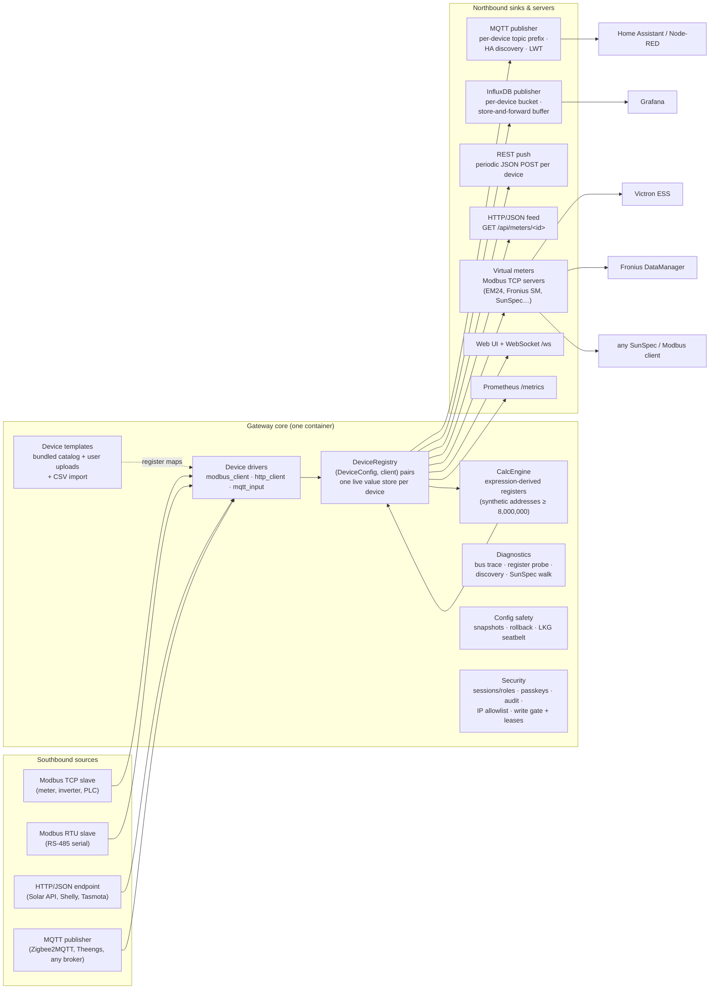
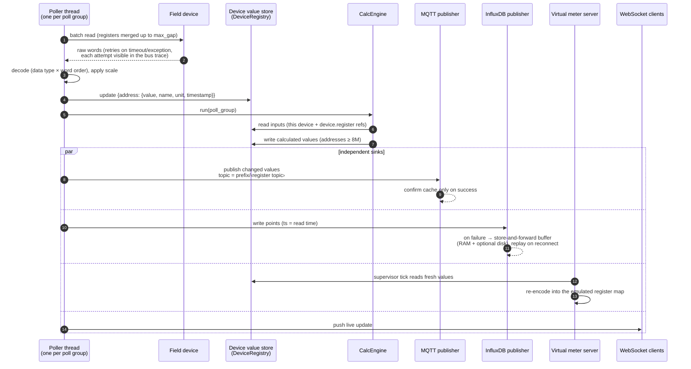

# Architecture — Multi-Bus Gateway 3.0.0

Multi-Bus Gateway is a **protocol gateway**: it acquires measurements from
southbound field devices (Modbus TCP, Modbus RTU, HTTP/JSON, MQTT), verifies
and normalizes them, and routes them to independent northbound sinks (MQTT,
InfluxDB, REST push, HTTP/JSON feeds) and to **virtual Modbus meters** that
re-serve the data to downstream consumers. It is *not* an energy-reporting or
billing application — cost, tariff and analytics are the job of whatever sits
downstream.

All facts below are drawn from the code in `multibus/` (Python package) and
`ui/` (vanilla-JS SPA). File references use `module.py` names.

## 1. System overview

Key properties:

- **Pipelines are independent.** Polling never depends on a sink; MQTT,
  InfluxDB and the virtual meters each reconnect on their own. A dead broker
  does not stop acquisition; a dead meter does not stop the UI.
- **The device id is the routing key.** Each device carries its own MQTT
  topic prefix, InfluxDB bucket + device tag, and output toggles
  (`DeviceConfig` in `config.py`).
- **Invisible migration.** Device #1 (the primary) is synthesized from the
  legacy flat `modbus:`/`mqtt:`/`influxdb:` sections of `config.yaml`, so an
  install upgraded from the single-meter era keeps byte-identical topics,
  buckets, tags and Home Assistant identifiers.

## 2. Core components

### DeviceRegistry (`device_registry.py`)

Owns the `(DeviceConfig, client)` pairs and **one live value store per
device** (`values: {device_id → store}`). A store is a dict keyed by register
**address**; each entry carries `{name, value, label, unit, timestamp,
poll_group}` (and `calculated: True` for derived values). The primary
device's store *is* the legacy `current_values` dict — same object, aliased —
which is what keeps the migration invisible. Mutations (add/replace/remove/
resync) are lock-protected; reads are lock-free snapshots.

### Device drivers

| Driver | Protocol | Model | Notes |
|---|---|---|---|
| `modbus_client.py` | Modbus TCP & RTU-master | one poller thread per poll group | batch reads with configurable `max_gap` merging; retry with error taxonomy (`timeout` / `exception_N` / `connection`); per-device staleness bound `stale_after_s` |
| `http_client.py` | HTTP/JSON | one poller thread per poll group | per-register `json_path` (dot/bracket paths, list indices); SSRF guard: URL must resolve to private LAN addresses only (pinned literal IP, redirects refused) unless `security.allow_nonlan_http_devices` |
| `mqtt_input.py` | MQTT subscribe | push-driven (no poll rate) | per-register `topic` with `+`/`#` wildcards or the device base topic; value from `json_path` or the bare payload |

All three produce the same normalized batch shape, so every sink works with
every source. Data types (`int16/uint16/int32/uint32/int64/uint64/float/
double/string`) and the four word orders (`abcd`, `cdab`, `badc`, `dcba`)
are handled centrally in `register_parser.py` (decode) and `encoder.py`
(encode, including SunSpec "not available" sentinel words).

### Device templates (`device_template.py`, `multibus/device_templates/`)

A template is a portable JSON file describing an equipment type: registers
(address, name, label, unit, data type, scale, category, poll group,
`json_path`/`topic` for non-Modbus transports), suggested defaults, and —
for writable registers — the **write safety envelope** (`writable`,
`write_min`, `write_max`, `write_safe`). Ten templates are bundled (Janitza
UMG 512-PRO with 4,126 registers, ABB B21/B23, Carlo Gavazzi EM24, Eastron
SDM120/SDM630, Schneider iEM3000, plus three MQTT-transport maps:
Zigbee2MQTT sensor, Theengs BLE, generic MQTT-JSON); provenance for each is
documented in [`device-catalog.md`](device-catalog.md). User templates
round-trip through upload/export and can be generated from a vendor CSV
([`csv-import.md`](csv-import.md)).

### CalcEngine (`calc_engine.py`, `expressions.py`)

Calculated registers are formula-derived measurements evaluated per poll
group, next to the real registers:

- Each calculated register gets a **synthetic address** `8,000,000 + i`,
  above any real Modbus address, in the *same* per-device store — so it
  flows to MQTT, InfluxDB, virtual meters, Monitor and History like any
  measurement.
- Expressions are validated and evaluated through a **whitelisted AST
  walker** (never `eval()`): arithmetic, comparisons, ternary, functions
  `min/max/avg/abs/round/sqrt/pow/floor/ceil/clamp`, constants `pi/e`,
  cross-device references (`device.register`), and the stateful helpers
  `prev(x)` (previous value) and `dt` (seconds since last evaluation) —
  enabling e.g. `(E - prev(E)) / dt * 3600` for power from an energy
  counter. Guards: 500-char limit, arity checks, bounded `**` exponent,
  division-by-zero → skip, a missing input skips the round (no partial
  publishes), and an engine error can never kill a poller.

### Value flow conventions

- **Timestamps** are the *read* time, not the publish/flush time.
- **Publish modes** per sink: `changed` (default; cache confirmed only after
  a successful publish, so nothing is lost to a failed send) or `all`.
- **Absence is never encoded as a measurement** — a missing value is skipped
  on MQTT/InfluxDB, reported as `stale` on the JSON feed, and handled by an
  explicit staleness policy on virtual meters (§4).

## 3. A poll → publish cycle

Failure behavior along this path:

- A failed read increments the per-kind error counters
  (`timeout` / `exception_N` / `connection`) surfaced on `/api/status`,
  `/metrics` and the Status page; the value store simply keeps its last
  entry with its old timestamp — consumers judge freshness by age.
- A failed MQTT publish leaves the change cache unconfirmed, so the value
  republishes after reconnect; on every reconnect the cache is cleared and
  full state republished (retained messages may have been lost).
- A failed InfluxDB write lands in the **store-and-forward buffer**
  (default 10 min / 50,000 points, persisted to
  `config/influx_buffer.jsonl` when `buffer_persist: true`) and is replayed
  with original timestamps — idempotent, since InfluxDB dedupes on
  measurement+tags+timestamp. MQTT is deliberately *not* replayed: it is a
  live bus; the current state is republished instead.

## 4. Virtual meters and the staleness convention

A virtual meter instance is an isolated Modbus TCP server (own thread, own
asyncio loop) that re-serves live values under another meter's register map
(templates: Carlo Gavazzi EM24, Fronius Smart Meter TS, SunSpec 213 float,
or any user-defined map). The datastore spans **only** the emulated map —
reads outside it get *illegal data address*, exactly like the real meter
being emulated. Composite templates may source rows from **several devices**
(`device.register`) and sum rows (`sum:`) — a sum takes the quality of its
worst member, never a partial total.

Every row resolves through a per-register staleness decision:

```mermaid
stateDiagram-v2
    direction LR
    [*] --> Fresh : value newer than its bound<br/>(row stale_after_s → source device bound → instance bound)

    Fresh --> Stale : age exceeds bound
    Stale --> Fresh : new value arrives

    state "Policy applied to a stale/missing row" as P {
        state "legacy (default)" as L
        state "fail" as F
        state "sentinel" as S
        state "hold" as H
        L : row keeps last words —<br/>freshness judged once per instance ·<br/>all-stale then server stops responding
        F : any read touching the row gives<br/>a Modbus exception (no partial truth)
        S : row served as SunSpec N/A —<br/>float→NaN, int16→0x8000, uint16→0xFFFF…
        H : last value held up to max_hold_s,<br/>then behaves like fail
    }

    Stale --> P
    P --> [*] : server stays up while ≥1 source is fresh<br/>(policy modes) · all dead then socket closes so the<br/>consumer's own meter-loss fail-safe engages
```

The rationale is a single rule: **absence is not encodable as a
measurement**. A frozen or zeroed value can mislead a control loop (ESS,
export limiter), so a stale row either refuses the read (`fail`), declares
itself not-available in the consumer's own vocabulary (`sentinel`), or is
held for a bounded, declared time (`hold`). `legacy` preserves the exact
pre-composite behavior for existing single-source meters.

Consumers that want the quality **in-band** (PLC/SCADA on the same Modbus
connection) can enable the read-only **quality block at 61440**
(convention v1): format version, block state (0 legacy / 1 ok / 2 degraded /
3 stale), fresh/stale/missing row counts, total rows, and the age of the
newest fresh value as u32 seconds. Wire spec:
[`virtual-meter-spec.md`](virtual-meter-spec.md).

The same data is available as JSON at `/api/virtual-meters/<id>/values`
using the aggregator convention: `value: null` when not good, plus
`quality: good|stale|missing`, `age_s`, and `last_value` kept separate.

Observability per instance: a 1024-entry query log (time, FC, address,
count, OK/exception, latency, response), counters, request-rate history,
most-read registers, active client connections, and lifecycle events —
plus retained MQTT state (`vmeter/<id>/state`) and HA discovery for the
meter's diagnostics.

## 5. Security model

Everything is **off by default** (trusted-LAN appliance) and opt-in per
layer: IP allowlist → API key → login/roles → write gate. All layers apply
independently.

Highlights (details in the manual):

- **Roles**: `admin` (everything), `operator` (live commissioning actions,
  including bounded Modbus writes, but nothing that lands in a config file),
  `viewer` (read-only). Anti-enumeration decoy hashing and per-IP lockout on
  login; sessions are in-memory (restart logs everyone out).
- **Passkeys (WebAuthn)**: per-user credentials in `config/passkeys.json`;
  require a secure context (localhost, or a hostname over HTTPS — an IP
  address is rejected as RP ID); passkey login shares the password lockout.
- **Reverse proxy**: `ui.trusted_proxies` feeds uvicorn's
  `forwarded_allow_ips` — X-Forwarded-* are honored only from listed proxies
  so the allowlist, lockout buckets and audit see real client IPs.
- **Write gate**: writes are OFF by default (`security.allow_writes`), the
  primary device is always read-only, encoding/bounds come from the template
  (never the caller), and a `lease_ms` write arms a **crash-safe dead-man
  lease**: the lease set is persisted to `config/write_leases.json`, so
  after a gateway crash the register is reverted to its declared
  `write_safe` value on the next boot.
- **Audit trail** (`audit.py`): append-only JSONL
  (`config/audit.jsonl`, 1 MB × 5 files rotation) of who did what — logins,
  writes, exports, restores — with secrets redacted from detail payloads.

## 6. Config safety

`config.yaml` + per-device register files + templates + `virtual_meters.yaml`
form the **config bundle**. Three mechanisms protect it:

1. **Automatic snapshots** — every successful config-bearing mutation
   schedules a snapshot (2 s debounce; bursts coalesce), retained 50 deep,
   plus manual snapshots with a note. Each is a full-fidelity ZIP.
2. **Semantic diff & rollback** — snapshots diff key-by-key (YAML/JSON
   aware, secrets masked), and restore replaces the bundle verbatim after
   taking a `pre-restore` snapshot, so a rollback is itself reversible.
3. **Last-known-good boot seatbelt** — after ~5 minutes of healthy uptime
   (with at least one successful device read) the bundle is marked LKG. At
   boot, a config that fails to parse is automatically restored from LKG and
   the load retried once — an unattended box survives a bad edit or a torn
   write. A corrupt `config.yaml` additionally blocks saves (the broken file
   is preserved as `.yaml.bad`) so defaults can never overwrite a user's
   real config.

Backups for *portability* are separate from snapshots: the export ZIP strips
secrets and host identity by default, and import merges over the live file
so stripped secrets survive the round-trip.

## 7. Observability

| Surface | What it carries |
|---|---|
| `/api/status` + Status page | per-device health, poll rates, error taxonomy (`timeout`/`exception_N`/`connection`), staleness, latency, sink stats, buffer counters |
| `/metrics` (Prometheus) | `gateway_device_*`, `gateway_mqtt_*`, `gateway_influx_*`, `gateway_vmeter_*` (incl. per-state quality gauges) |
| `/health` | container probe; HTTP 503 only for a genuinely down virtual meter — an unreachable upstream degrades the body but never restart-loops the container |
| Event log (`config/events.jsonl`) | persisted ring of read failures, sink transitions, vmeter lifecycle, rollbacks, alerts |
| Alerts (`alerts:` block) | infrastructure-health alerts (device/sink/latency/buffer) to MQTT `<prefix>/alert` and/or an HTTP webhook — see [`alerts-webhooks.md`](alerts-webhooks.md) |
| Bus trace + register probe | frame-level TX/RX hex with per-retry entries; one-shot reads decoded as every type × word order |

## 8. Process model

One container, one Python process (`main.py`):

- FastAPI/uvicorn serves the UI, REST API and WebSocket
  (default `0.0.0.0:8080`, optional TLS).
- Poller threads per device × poll group; push-driven MQTT-input clients.
- One thread + asyncio loop per virtual meter instance; a supervisor thread
  ticks freshness and restarts wedged listeners.
- Background threads: MQTT/InfluxDB reconnect monitors, REST pushers,
  write-lease sweeper, snapshot debouncer, LKG marker.
- Hot-reload by design: device/register/poll/sink changes apply without a
  container restart; only UI TLS changes and (recommended) newly imported
  devices need one.
